[back to readme](README.md)

Crown Copyright (c) 2026
#  Core

#  version: 0.1.1 (RC1)
## Contents
* Introduction Diagrams
    * [Core Overview](#9f186615-53a2-4a74-ac80-e53c1c9a001d)
    * [Where and When](#0413ea99-33f2-49f1-8418-3b75ee5ff050)
    * [Start and End](#fdb5987c-8a05-489a-867b-5a6a7eaafdeb)
    * [Time (1 of 2)](#3dcf73cb-fceb-4a67-9396-4b542f0ffcf1)
    * [Time (2 of 2)](#7be3bcf2-11b5-42b9-9446-b35daba1be5d)
    * [Activity and System](#79be5410-50ed-4e9c-9592-304861a72139)
    * [Extending IES](#ca422cac-e649-4756-b763-03a81d8217fb)
    * [Signs and Representations](#58decf6f-1b09-42e6-89d8-3959b521b231)
    * [Names and Identifiers](#f9eac7d7-f1dd-422b-a80e-fb97ace0a84b)
    * [Characteristics and Measures](#aba20bac-eae4-4a59-8772-e34a670e6042)
    * [Disposition](#cbe62e9d-537c-4f33-a2db-9679c2058565)
    * [Stuff and Count](#9382b5ff-d811-4425-977d-ceab0b83fb19)
    * [Similarity and The Same](#d169e6c9-8611-4dd0-85e5-d86967c8672e)
    * [Attributes](#deb8172a-8c96-43bc-92f8-4e1d743224fb)
    * [Source Reference](#f210348a-622d-4fcd-93b1-4445beb53ff2)
    * [Living Organism](#2d551fc7-99e0-44d4-940f-e9980de110ae)
    * [Human-made Artefact](#088dcb60-cec5-4ed8-a9c2-5b1ff7fde43c)
    * [Location](#9af0242c-d01a-44de-a965-cd93454b4e7f)
    * [Document](#e92412a1-25ed-4292-b471-da70de7ed415)
    * [Ticket](#47ba2ddf-565b-41e1-9387-514f930a6237)
* [System](#System)
    * [Person](#4f034e11-1204-44ad-9aec-964a5606aed9)
    * [Organization](#ee1b43fc-5dc3-4d3e-89c5-823796afb292)
    * [Vehicle](#6bac87b0-55e0-4007-8ad3-581d71535af7)
    * [Information Processing System](#b94dd74f-76c9-42dd-924f-a4ea6a67721a)
* [Activity](#Activity)
    * [Communication and Attendance](#5948de5e-2ae1-40d7-8e86-1b834b13c3f2)
    * [Account](#4a863e14-82df-4fa0-bc71-b827e830b362)
    * [Presence](#20b67908-c35f-4716-8357-9c769f908710)
    * [Entitlement and Ownership](#06752635-fe0c-4643-9e62-c8f9c1441d45)
    * [Exchange](#9b1fa0e6-bb23-41a3-b971-19f5715852eb)
    * [Movement](#9036fe4f-4133-4a19-a062-32650783ed2d)
    * [Governance](#414d32e6-6055-449d-82f6-1897789b6be8)
    * [Observation](#87163cdc-9f54-4649-aec8-4753fd92e4d2)
    * [Assessment](#9871bdeb-c2f2-4e9f-bd30-b476fca46bf0)
    * [Access](#230d023f-7c2e-48ab-9de5-4788e484dba1)
    * [Lifecycle](#bcfbc5c8-7d3d-47d8-a13a-d810975bbf3d)
* [All Resources](#ies_core)
## Core Overview
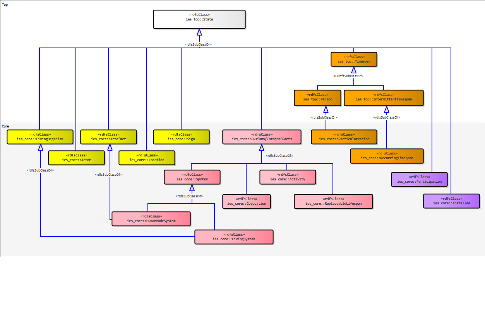

### IES elements in this diagram:

* [Sign](#0600cef2-32e9-4cbd-899a-1319379aebab)
* [Participation](#b47636e7-e6c4-456f-b755-8ad164240a33)
* [Period](#d77a3301-53bb-4820-a86a-f7c6a0d4c9a4)
* [Artefact](#221ba44e-7562-4b00-bb1d-7c246d738fe1)
* [Actor](#91dc289a-74a8-40b9-b737-feaa7424bc6c)
* [LivingOrganism](#a2c20353-f683-4d31-a7dd-455813527f4b)
* [Location](#110efc77-c1d2-4eb5-87f6-677f73eb8424)
* [Installed](#9f9982b7-12c3-432a-b5cc-0195eb5708b1)
* [FusionOfIntegralParts](#519227c7-5c84-4ae0-8e44-b6eeb29e4f58)
* [Activity](#443e9eac-efa7-4a34-8299-27822a193d5d)
* [System](#a0cf4d1d-294d-41ca-8baa-b8bc12efe9b2)
* [HumanMadeSystem](#f6b05d87-5fd9-437d-b2b2-366407489912)
* [LivingSystem](#35ca2c27-e7a2-465a-b529-ab9afbb1b25c)
* [ParticularPeriod](#244a8229-b9b1-4a12-9d19-aa0eb090397e)
* [Timespan](#b9900e87-e85c-4378-8afe-d3a5ef0168a0)
* [ReplaceableLifespan](#d71ca01c-58a9-48a5-b92c-589df7519f47)
* [CoLocation](#57160f30-618c-4b30-b817-be952b309052)
* [State](#885fc001-7738-47ab-8870-30d004a57180)
* [IntermittentTimespan](#ed41858d-a919-4e57-9c60-e2333556c826)
* [RecurringTimespan](#6b68585b-ab19-48a0-8254-1d6768f88833)

IES-Core is built upon IES-Top providing a common foundational layer of patterns and concepts useful for expressing information in all manner of domains. Patterns such as Activities, Systems, Characteristics and Representations. This also includes lower-level concepts like Persons, Locations etc. Core is the mid-level ontology which will be the replacement of the top layers of IES4. Domain specific ontologies are expected to be built upon IES-Core.

IES-Core extends IES-Top into 3 major ways.
<ol>
	<li>It extends <i>State</i> to allow us to talk about familiar tangible individuals -known as <i>Entities </i>in IES4. These include living individuals (<i>LivingOrganism</i>), human-made objects (<i>Artefact</i>), places (<i>Location</i>), individuals capable of conscious action or can effect change on the world (<i>Actor</i>) and individuals that symbolize or signify other individuals (<i>Sign</i>). These categories can naturally overlap, for example, a person is both a <i>LivingOrganism</i> and an <i>Actor</i>. IES-Core embraces such multiple inheritance, producing a flatter, more flexible hierarchy than IES4.</li>
	<li>It extends <i>State</i> to provide mechanisms to describe how states combine (fuse) to form new states of interest: an <i>Activity</i> (<i>Event</i> in IES4), which is a fusion of temporal parts (<i>Participations</i>) of other states (e.g. participations of persons to make a <i>Meeting)</i>; <i>System, </i>which is the fusion of dependent states of which make up a system and which cannot exist without (e.g. a motorized road vehicle - made up of an engine, a chassis and wheels). Note, even seemingly tangible individuals can be treated as a <i>Systems</i> - e.g. <i>Vehicle</i>, is both an <i>Artefact</i> and a <i>System.</i> It is often useful with systems to see their parts as being <i>Installed</i> or removed but also call out the identity of dependent parts that endure. This persistence lets us refer to those parts even when they're temporarily uninstalled - for instance, the front-right wheel of a car, regardless of which actual wheel is installed at a given time. <i>ReplaceableLifespan</i> provides this timeless component but also can be used for other individuals that are replaceable outside systems e.g. the CEO of a company or the head of state of a nation.</li>
	<li>Extends <i>Timespans</i> to represent timestamps, periods, durations, and recurrences in a 4D-faithful manner, while ensuring interoperability with common computer standards such as ISO 8601.</li>
</ol>

## Where and When
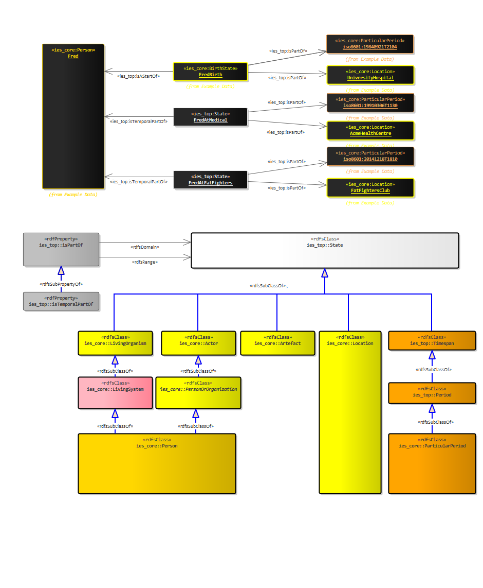

### IES elements in this diagram:

* [State](#885fc001-7738-47ab-8870-30d004a57180)
* [isPartOf](#b51571e4-8ac5-4387-bb47-ab110e15f586)
* [isTemporalPartOf](#91245399-d5d7-4ad7-a8da-c0db2f9e4332)
* [Actor](#91dc289a-74a8-40b9-b737-feaa7424bc6c)
* [LivingOrganism](#a2c20353-f683-4d31-a7dd-455813527f4b)
* [Location](#110efc77-c1d2-4eb5-87f6-677f73eb8424)
* [Timespan](#b9900e87-e85c-4378-8afe-d3a5ef0168a0)
* [PersonOrOrganization](#cc6c3605-ccf7-4f23-af4c-0be46f1fb5f5)
* [Person](#673a1da9-3a5d-4310-9752-f0899f31de5d)
* [Period](#d77a3301-53bb-4820-a86a-f7c6a0d4c9a4)
* [ParticularPeriod](#244a8229-b9b1-4a12-9d19-aa0eb090397e)
* [Artefact](#221ba44e-7562-4b00-bb1d-7c246d738fe1)
* [LivingSystem](#35ca2c27-e7a2-465a-b529-ab9afbb1b25c)

Because IES is a 4D ontology, it treats time and space - in fact, spacetime - in a unified way. If something happens entirely within a location, it is part of that location. If a person walks through a location, there is a temporal chunk of them that is part of that location. Similarly, if something happens in a particular period of time, it is part of that period of time. Everything we describe about physical entities use <i>State</i>, whether referring to properties that span an entire lifetime (e.g., a person's ethnicity) or to a brief interval (e.g., the color of their hair when they dyed it in teenhood). In IES-Core we call out whole-life states using specific subtypes of <i>State</i> like <i>Person</i> and <i>Vehicle</i>. They themselves are made up of many states, each representing a temporal part of the whole. 
In the example presented here, we articulate three different locations in Fred's life. These are three temporal parts of Fred - i.e. a different point in his life. The complete, lifelong Fred is represented by an instance of <i>Person</i>, while his three temporal parts are represented by <i>States</i>. In IES4 these would have been instances of <i>PersonState</i>, but IES-Core simplifies this: the relationship to the whole (a Person, in this case) implies the specific type of state (PersonState).

## Start and End
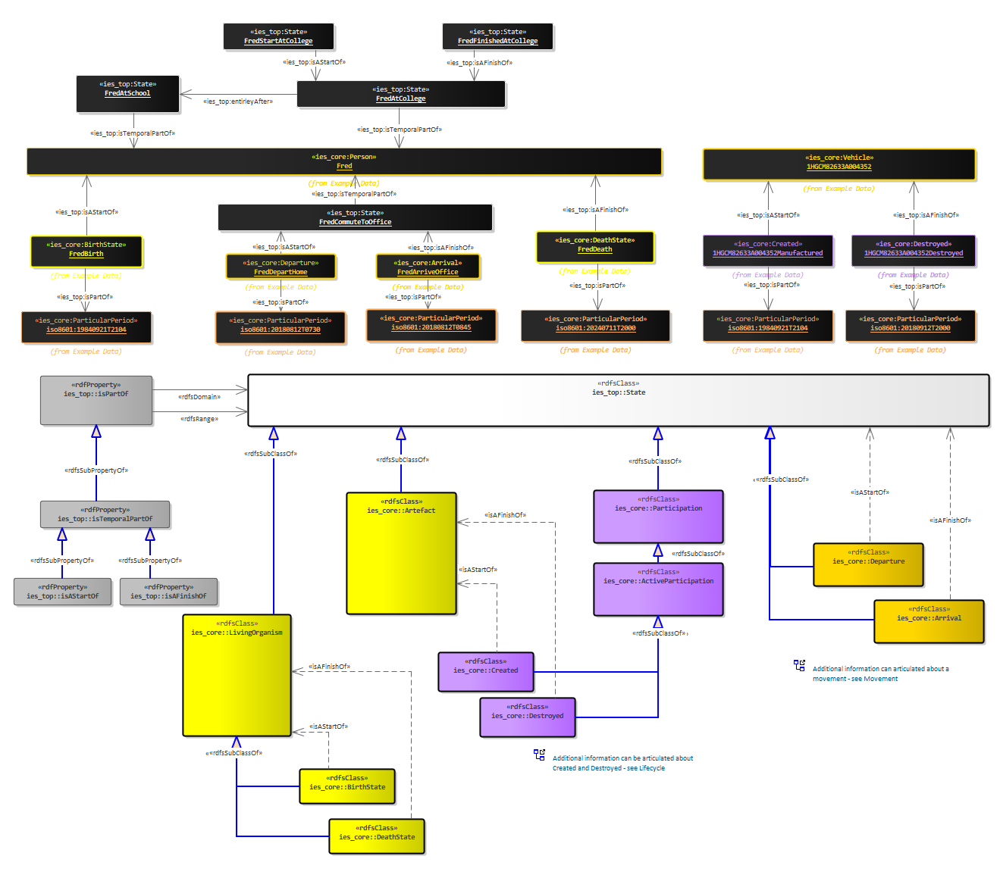

### IES elements in this diagram:

* [State](#885fc001-7738-47ab-8870-30d004a57180)
* [isPartOf](#b51571e4-8ac5-4387-bb47-ab110e15f586)
* [isTemporalPartOf](#91245399-d5d7-4ad7-a8da-c0db2f9e4332)
* [isAStartOf](#c939a967-d8a7-4a4b-bac3-ca1631a54b82)
* [isAFinishOf](#291c902a-0cac-467e-9c3a-ad8ee537cb3d)
* [BirthState](#63855454-6ab8-44fb-b61e-83d442b44fd0)
* [DeathState](#31b164c8-443c-4457-a4d3-eabed321fd93)
* [Created](#0ab30909-6d5a-4ff0-8456-888c7204054e)
* [Destroyed](#a9ee8f29-2561-4b09-aec0-142de9beb778)
* [ActiveParticipation](#b3358483-a264-4412-9d00-ba82e3752cd7)
* [Participation](#b47636e7-e6c4-456f-b755-8ad164240a33)
* [Departure](#9d283645-51ed-46ad-8cc5-284c372fcf12)
* [Arrival](#93ed6955-f6b9-4d4e-b174-10550153761a)
* [LivingOrganism](#a2c20353-f683-4d31-a7dd-455813527f4b)
* [Artefact](#221ba44e-7562-4b00-bb1d-7c246d738fe1)

The starts and ends of an individual are special temporal parts of that individual. They are the portions of that individual that exist at its start and at its finish. These are temporal parts that relate to the whole using special forms of the <i>isTemporalPartOf</i> property - <i>isAStartOf</i> or and <i>isAFinishOf</i>. The naming of these relations - implying that they are one of many, is deliberate. From a 4D perspective a single entity can have multiple intervals that mark its beginning - for example Birth and Childhood are well understood starts of a person. Likewise, same goes for ends. While a person's life is considered at its end at death, we may also speak of an ending in terms of adulthood but equally or, sadly, in some cases, childhood or even at birth.
Generally, the temporal part which is either the start or end of a state is itself an instance of <i>State</i>, however there are special start states and end states we call out. They include <i>BirthState</i> and <i>DeathState</i> for <i>LivingOrganisms</i> like <i>Person</i>; <i>Departure</i> and <i>Arrival</i> for bounding the start and end of a moving individual (see Movement for more details) and; <i>Created</i> and <i>Destroyed</i> which is common for human-made individuals (<i>Artefacts</i>). <i>Created</i> and <i>Destroyed</i> states also are complimented by the Activities of <i>Create</i> and <i>Destroy</i> and allows the articulation of who was involved in the creation or destruction (see Lifecycle for more details).
The use of the <i>isAStartOf</i> and <i>isAFinishOf</i> relations in combination with the <i>entirelyAfter</i> relation allow complex temporal logic to be expressed using very simple constructs - e.g. states starting before others, ending before others, etc.

## Time (1 of 2)
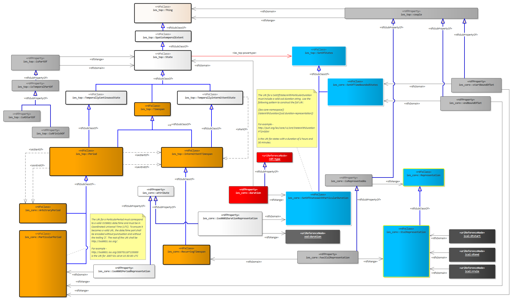

### IES elements in this diagram:

* [endBoundOfSet](#20732e8a-a42b-4cf5-be38-c005a2be6b46)
* [startBoundOfSet](#8343be41-469d-40b8-bff2-1c3b78488d6f)
* [SetOfTimeBoundedStates](#18182b3f-22e3-4682-a4ce-5bd09e6c3c09)
* [SetOfStates](#e25c3b00-4ca3-40f4-9443-15c9dc4ee972)
* [SpatiotemporalExtent](#dcb3f671-0fa3-4de6-b037-a011c432a087)
* [Thing](#27c6bcf1-9ffe-4172-ac2c-e32653b43014)
* [couple](#85feafd9-50a0-42ea-9cc7-8dc7b055f47b)
* [hasICalRepresentation](#f624db5f-59ec-437f-97b2-e52a0306e074)
* [isRepresentedAs](#37400026-3e6b-4960-a8e8-832c55ddb10f)
* [Representation](#a4a8f4f5-edc5-48a9-a926-024a25801f5f)
* [ICalRepresentation](#fb6ffbda-2dac-4524-920f-16d6bd69e109)
* [isAStartOf](#c939a967-d8a7-4a4b-bac3-ca1631a54b82)
* [isAFinishOf](#291c902a-0cac-467e-9c3a-ad8ee537cb3d)
* [isTemporalPartOf](#91245399-d5d7-4ad7-a8da-c0db2f9e4332)
* [isPartOf](#b51571e4-8ac5-4387-bb47-ab110e15f586)
* [RecurringTimespan](#6b68585b-ab19-48a0-8254-1d6768f88833)
* [ArbitraryPeriod](#76f0e234-ca6e-40b7-905e-8d5c30f24209)
* [iso8601PeriodRepresentation](#75dbf1ee-2c1f-4131-95e2-1d476a1eae31)
* [ParticularPeriod](#244a8229-b9b1-4a12-9d19-aa0eb090397e)
* [IntermittentTimespan](#ed41858d-a919-4e57-9c60-e2333556c826)
* [Timespan](#b9900e87-e85c-4378-8afe-d3a5ef0168a0)
* [Period](#d77a3301-53bb-4820-a86a-f7c6a0d4c9a4)
* [TemporallyIntermittentState](#54795bb4-0a44-4837-ad45-2e51ede3dd2f)
* [TemporallyContinuousState](#01fbe830-dc8b-4c9d-8cda-d8d2bfd22dfe)
* [State](#885fc001-7738-47ab-8870-30d004a57180)
* [SetOfStatesWithParticularDuration](#0dea64c8-e003-488f-b9e6-a8178fc65be7)
* [duration](#482f061e-4262-40f8-87b9-b099d9ac7f7b)
* [attribute](#4ac55554-9e8c-43a4-baf8-5cc912a6be07)
* [iso8601DurationRepresentation](#098e6261-4d32-475c-8de1-33daa558d478)

The big advantage to a 4D ontology is that time is treated the same way as space. This allows complex temporal logic information to be expressed using very simple constructs. <i>Timespans </i>are treated like any other state -e.g. assembled with <i>isPartOf </i>relationships. Technically, <i>Timespans </i>only differ from other states in that they are all of the universe during a time interval, or put another way, temporal parts of the universe.
<i>Timespans </i>come in two major forms, continuous, uninterrupted stretches of time known as <i>Periods</i> and interrupted or gappy timespans which are known as <i>IntermittentTimespans</i>.
IES-Core also allows a <i>duration</i> to be specified even when the precise start and end are not known - e.g. we can specify a meeting lasted an hour and took place on a particular day, but we don't know what time it began and ended.

## Time (2 of 2)
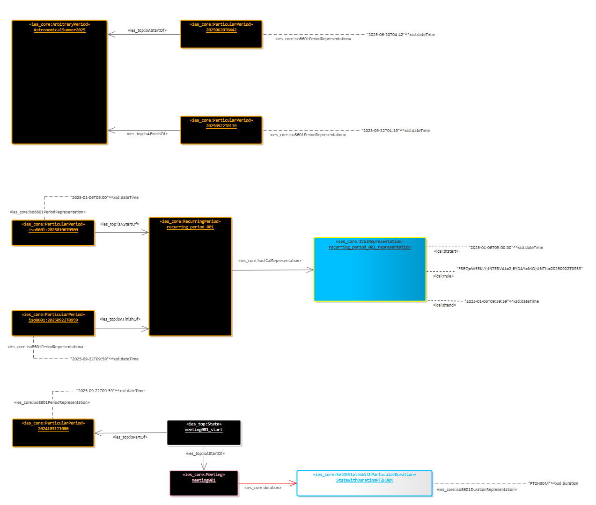

### IES elements in this diagram:

He we demonstrate with examples, how ParticularPeriods, ArbitraryPeriods, RecurringTimespans, and Durations are used.

ParticularPeriods: To prevent duplicate ParticularPeriods being created, the URI of each instance should reflect the ISO8601 datetime in Coordinated Universal Time (encoded without punctuation). So, for example, the URI for January 2008 would be http://iso8601.iso.org#200801. To enable querying the attribute <i>iso8601PeriodRepresentation</i> must also be provided. Its value shall be a literal string encoded in UTC (Coordinated Universal Time) but unlike the URI, it must be punctuated. For example: "2007-01-18T15:30:00"

ArbitraryPeriods: These are used for period of time that cannot be expressed directly as calendar dates. They are defined by specifying their start and end using ParticularPeriods. See the Astronomical Summer 2025 example provided.

RecurringTimespans: These support the expression of recurrences (e.g. "every Tuesday from 28 August 2018 to 2 October 2018" or "13:00 to 14:00 every day from 27 June 2016 to 2 October 2024"). RecurringTimespans are paired with a special form of Representation called ICalRepresentation which allows the expression of the complex recurrences using the iCal RDF ontology. Only three iCal RDF predicates shall be used in this regard: 
- ical:rrule defines the recurrence (e.g., FREQ=WEEKLY;INTERVAL=1;BYDAY=MO;UNTIL=20250930T000000Z)
ical:dtstart and ical:dtend define the start and end of the first known instance of the recurrence.
In the example provides these three properties together describe a recurring timespan of every Monday from 09:00 to 09:59.
A RecurringTimespan is bounded by start and end ParticularPeriods, similar to an ArbitraryPeriod. The end ParticularPeriod must align with the UNTIL value in the ical:rrule.

Durations: To represent the duration of a state, IES-Core uses SetOfStatesWithParticularDuration, of which the state is a member. A shown in the example, a meeting lasting 2 hours and 30 minutes is expressed as belonging to the set of all states with that duration. The URI for a SetOfStatesWithParticularDuration shall follow this pattern:
{{ies-core-namespace}}StateWithDuration{{xsd:duration-representation}}
For querying, the attribute <i>iso8601DurationRepresentation </i>must also be provided. Its value is an xsd:duration and shall match the one used in the URI.

## Activity and System
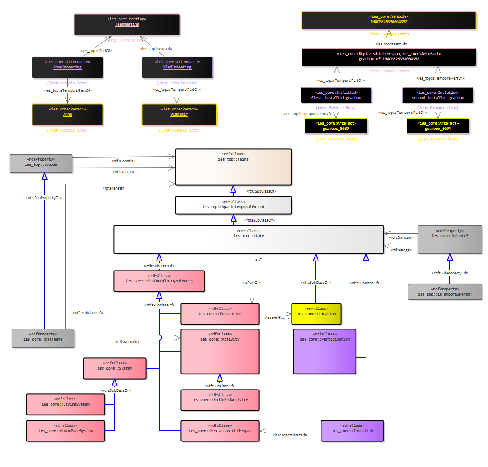

### IES elements in this diagram:

* [Activity](#443e9eac-efa7-4a34-8299-27822a193d5d)
* [EndToEndActivity](#a72bc26a-54e4-4531-924e-9d2508ee358b)
* [hasTheme](#e6fd0971-b0ef-48ec-a6a0-d0edb0e0c3ab)
* [couple](#85feafd9-50a0-42ea-9cc7-8dc7b055f47b)
* [Thing](#27c6bcf1-9ffe-4172-ac2c-e32653b43014)
* [FusionOfIntegralParts](#519227c7-5c84-4ae0-8e44-b6eeb29e4f58)
* [Installed](#9f9982b7-12c3-432a-b5cc-0195eb5708b1)
* [Participation](#b47636e7-e6c4-456f-b755-8ad164240a33)
* [State](#885fc001-7738-47ab-8870-30d004a57180)
* [SpatiotemporalExtent](#dcb3f671-0fa3-4de6-b037-a011c432a087)
* [System](#a0cf4d1d-294d-41ca-8baa-b8bc12efe9b2)
* [LivingSystem](#35ca2c27-e7a2-465a-b529-ab9afbb1b25c)
* [HumanMadeSystem](#f6b05d87-5fd9-437d-b2b2-366407489912)
* [ReplaceableLifespan](#d71ca01c-58a9-48a5-b92c-589df7519f47)
* [isPartOf](#b51571e4-8ac5-4387-bb47-ab110e15f586)
* [isTemporalPartOf](#91245399-d5d7-4ad7-a8da-c0db2f9e4332)
* [CoLocation](#57160f30-618c-4b30-b817-be952b309052)
* [Location](#110efc77-c1d2-4eb5-87f6-677f73eb8424)

Activities and systems are treated in IES-Core as fusions (or the sum of) other states (<i>FusionOfIntegralParts</i>). 
In the case of <i>Activity </i>(<i>Event</i> in IES4), these are incidents in the world that are of interest e.g. business meetings, telephone calls, acts of war. They are the sum of temporal parts participating in the <i>Activity</i>, which we call out as a special form of <i>State</i> called <i>Participation</i>.
<i>System</i> is the fusion of dependant states of a whole (a system), which the system cannot exist without e.g. a motorized road vehicle - made up of an engine, a chassis and wheels or a person and their heart. Understanding a system's parts can be straight-forward at any given time, however that is complicated by changes over time. For example, a car's components, like its gearbox or tires, can be replaced when worn. When we replace a car's gearbox, it remains the same car, just with a different gearbox. BORO(TM) and 4D thinking clarifies this: the extent of the car contains a temporal part of one gearbox followed by the temporal part of another gearbox (and possibly multiple more during the car's existence). At any one time, the car overlaps with only one gearbox; but, over time, it overlaps with two (or more) gearboxes. Each gearbox has a temporal part, which IES-Core calls <i>Installed,</i> that are parts of the car.
Sometimes it is useful to call out the enduring part of a system e.g. the gearbox of a car whichever actual gearbox is installed at a given time. This is what we call a <i>ReplaceableLifespan</i>. A <i>ReplaceableLifespan</i> can be substituted or exchanged without altering the overall identity or functionality. Moreover, the identity of a <i>ReplaceableLifespan</i> can survive periods when nothing fulfils its purpose or role, i.e. its existence is not necessarily continuous.
In IES-Core, we instantiate this enduring, replaceable lifespan as both a <i>ReplaceableLifespan</i> and the class of <i>State</i> that is intended to be installed into it. For example, the replaceable gearbox part of a car is instantiated as both a <i>ReplaceableLifespan</i> and a Gearbox. <i>ReplaceableLifespan</i> can be used for other states that are replaceable outside systems e.g. the CEO of a company or the head of state of a nation.

## Extending IES
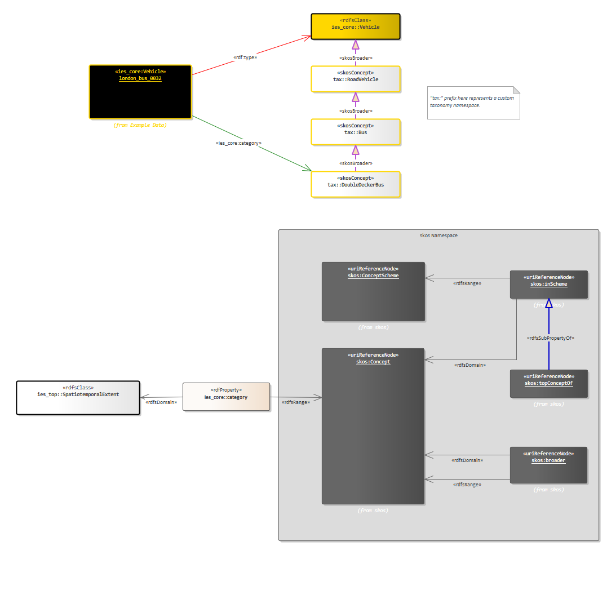

### IES elements in this diagram:

* [Thing](#27c6bcf1-9ffe-4172-ac2c-e32653b43014)
* [category](#fb9df2ee-cbeb-4bf5-abd4-34405dc3bc52)
* [Vehicle](#2a33309a-f899-469f-8133-db01cfdb5e68)
* [RoadVehicle](#fe0b01e3-c6cf-4dd8-9763-6fd4af05ed9c)

As with the previous version of IES, IES-Core allows the model to be extended to incorporate new concepts. IES4 allowed the extension of the ontology using RDF Schema which saw users add new classes or properties using subtypes of those found in IES4. The drawback of this approach was that data consumers needed to know the specification of each custom extension or, the data producer was obliged to instantiate instances as both a class/property in IES4 and a class in their extension.
While RDF Schema extensions are still possible in IES-Core they shall only be used when the extension introduces new semantics -for example, when a new class is required to capture relationships or attributes not in IES-Core or IES-Top. 
Historically, most IES extensions have been purely <i>taxonomic</i> - adding narrower categories of existing concepts (e.g., more specific types of Vehicle) without introducing additional semantics.
To better support this common use case, IES-Core now adopts <b>SKOS</b> (Simple Knowledge Organization System) -a lightweight RDF-based standard for controlled vocabularies such as glossaries and taxonomies.
SKOS will be used for extending IES in the following way:
<ol>
	<li><ol>
	<li>Taxonomic extensions to IES are to be defined as instances of skos:Concept.</li>
	<li>The skos:broader property is to be used to make a link from a skos:Concept to its parent IES class(es) (or another skos:Concept). skos:narrower shall not be used for links to IES classes - skos:broader already implies the inverse relationship and avoids extra handling for consumers.</li>
	<li>Instances remain typed using rdf:type, whose range must always be an IES class - even when an extension concept is associated.</li>
	<li>The ies:category - a property in the IES-Core ontology, shall be then used to link an instance of an IES class to a skos:Concept. This is what further defines it (taxonomically) as a new extension.</li>
</ol>
</li>
</ol>

This regime minimizes the burden on data consumers - regardless of any custom SKOS extensions, the rdf:type of every instance always resolves to an IES class that all consumers understand.

## Signs and Representations
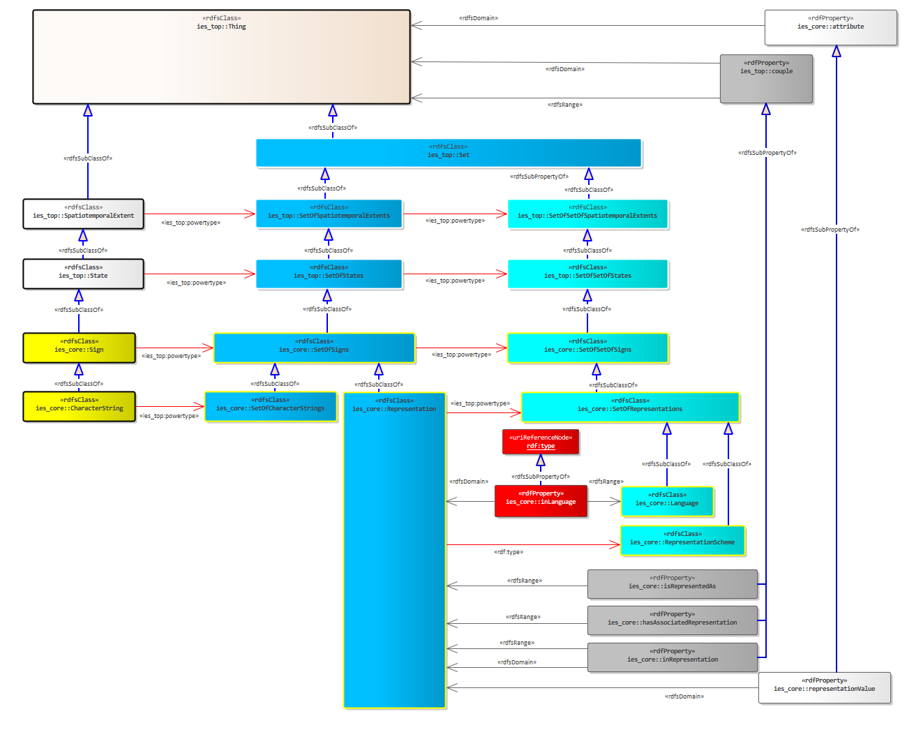

### IES elements in this diagram:

* [Set](#059b5013-017b-496f-b104-ea82b69b8792)
* [Thing](#27c6bcf1-9ffe-4172-ac2c-e32653b43014)
* [State](#885fc001-7738-47ab-8870-30d004a57180)
* [SpatiotemporalExtent](#dcb3f671-0fa3-4de6-b037-a011c432a087)
* [couple](#85feafd9-50a0-42ea-9cc7-8dc7b055f47b)
* [SetOfSpatiotemporalExtents](#0c4a5ca9-a706-4653-ab55-69d2fcab0d23)
* [SetOfSetOfSpatiotemporalExtents](#33a6e9f9-54b5-4045-8733-ce821d972c6f)
* [Sign](#0600cef2-32e9-4cbd-899a-1319379aebab)
* [Representation](#a4a8f4f5-edc5-48a9-a926-024a25801f5f)
* [SetOfSigns](#4e054f55-b874-4f4d-b5f3-30963d987a3e)
* [CharacterString](#f3b474cb-755e-4062-a714-f55b01e54924)
* [SetOfCharacterStrings](#fec11cc7-b62f-42fc-806b-c45c2d026021)
* [isRepresentedAs](#37400026-3e6b-4960-a8e8-832c55ddb10f)
* [SetOfStates](#e25c3b00-4ca3-40f4-9443-15c9dc4ee972)
* [SetOfRepresentations](#7814f7f3-b1f9-4bee-a35d-82eff80d1f3c)
* [RepresentationScheme](#f014d221-b422-4776-bffa-21d53afde0c6)
* [SetOfSetOfStates](#44a34647-ea2f-4635-8dd4-9e48008a85af)
* [SetOfSetOfSigns](#bb9fd5e2-98d1-4690-b8c8-08796fdae208)
* [hasAssociatedRepresentation](#9c14da25-c1a8-456e-aea9-37ea1c6e01ac)
* [inRepresentation](#79f72fb1-6350-4761-96c8-f6d1358566f6)
* [attribute](#4ac55554-9e8c-43a4-baf8-5cc912a6be07)
* [representationValue](#344e42f1-2ac3-4fe8-bf30-c78285944484)
* [Language](#33330343-4547-4cf1-9277-f2eb5548724f)
* [inLanguage](#9881a5a7-ec98-461f-a1a3-b7e2b2cfbd7d)

<i>Signs</i> are <i>States</i> that symbolize or refer to other <i>Things</i>. They can take many forms: a spoken or written word, a drawing, a printed symbol, or any other communicative mark. In most situations we are not concerned with individual instances of a sign. For example, no single occurrence of the word "IES" in this document, on its own represents the IES ontology. Rather, any occurrences -whether printed on paper, scribbled in a notebook, or stored digitally, conveys the reference. For this reason, the use of SetOfSigns, or more specifically Representations are more useful. An exception might be a specific, unique sign (for example, graffiti on a particular vehicle) where that single occurrence is significant. This differentiation between individual instances of a sign and the collection is useful in regards to documents (See Document for more details).
Sometimes it is important to establish arbitrary categories of Representation - such as "pictures of kittens" or "educational films". A <i>SetOfRepresentations</i> can be used to collect together all Representations of similar content.

## Names and Identifiers
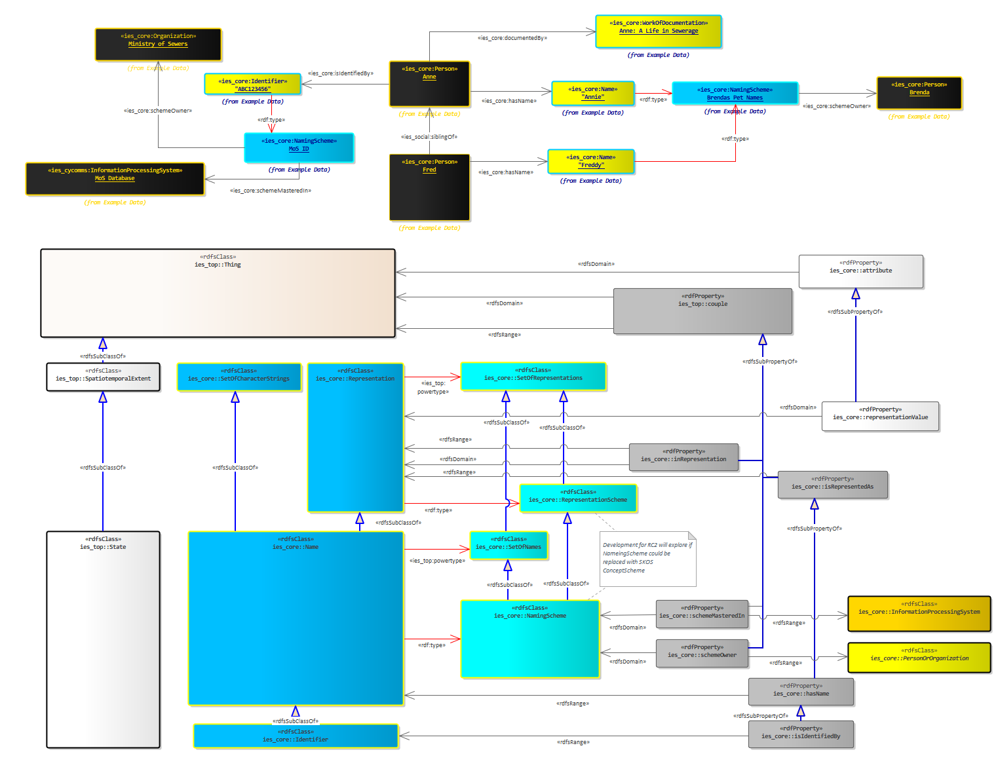

### IES elements in this diagram:

* [representationValue](#344e42f1-2ac3-4fe8-bf30-c78285944484)
* [attribute](#4ac55554-9e8c-43a4-baf8-5cc912a6be07)
* [inRepresentation](#79f72fb1-6350-4761-96c8-f6d1358566f6)
* [Identifier](#4357d08f-93d3-4e09-b816-df7226360339)
* [NamingScheme](#a8c23395-92c8-4f26-9b16-e4103d40656c)
* [SetOfNames](#49585484-74e3-4ce1-98e3-12cc89379a35)
* [RepresentationScheme](#f014d221-b422-4776-bffa-21d53afde0c6)
* [SetOfRepresentations](#7814f7f3-b1f9-4bee-a35d-82eff80d1f3c)
* [isRepresentedAs](#37400026-3e6b-4960-a8e8-832c55ddb10f)
* [hasName](#d6ae651c-2252-47ff-85b9-848d14a8ab26)
* [couple](#85feafd9-50a0-42ea-9cc7-8dc7b055f47b)
* [Name](#53e385f5-19e0-431a-970f-e49f3f6e6680)
* [SetOfCharacterStrings](#fec11cc7-b62f-42fc-806b-c45c2d026021)
* [Representation](#a4a8f4f5-edc5-48a9-a926-024a25801f5f)
* [Thing](#27c6bcf1-9ffe-4172-ac2c-e32653b43014)
* [SpatiotemporalExtent](#dcb3f671-0fa3-4de6-b037-a011c432a087)
* [State](#885fc001-7738-47ab-8870-30d004a57180)
* [isIdentifiedBy](#53f6c6c7-1dab-408b-98f3-162e7c72f95a)
* [schemeOwner](#20d7d2a7-0b41-417a-afab-9ecb97dc710e)
* [schemeMasteredIn](#08f7bc6a-0df3-4bae-8cd9-5eb21e3f6ff1)
* [InformationProcessingSystem](#b0166f18-6edd-4ec3-bfe2-f19db449e5c1)
* [PersonOrOrganization](#cc6c3605-ccf7-4f23-af4c-0be46f1fb5f5)

One of the most common uses of <i>Representations</i> in the world are <i>Names</i> and <i>Identifiers</i>. IES allows for multiple Names and Identifiers to be assigned to any given <i>Thing</i>.
Names and Identifiers belong to <i>NamingSchemes</i> - this allows us to give context when a <i>Thing </i>has more than one <i>Name</i> or <i>Identifier</i>.

## Characteristics and Measures
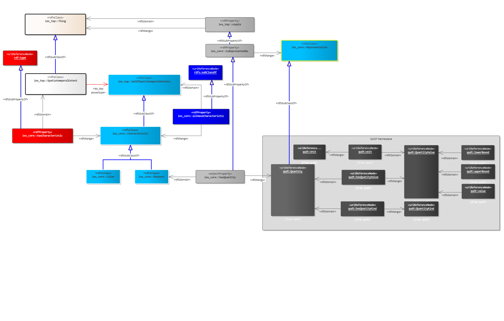

### IES elements in this diagram:

* [SetOfSpatiotemporalExtents](#0c4a5ca9-a706-4653-ab55-69d2fcab0d23)
* [Characteristic](#2085ee5c-09ce-4467-bc60-5bb5c7af4f02)
* [Measure](#39c677c9-089d-48ea-bc7e-dbfc894282ca)
* [isRepresentedAs](#37400026-3e6b-4960-a8e8-832c55ddb10f)
* [hasQuantity](#6f9353e2-2cfa-4017-a2af-3359ad131039)
* [Representation](#a4a8f4f5-edc5-48a9-a926-024a25801f5f)
* [allHaveCharacteristic](#c17aaa45-7699-42c1-86d3-2ad01d0209ba)
* [hasCharacteristic](#b7999e75-fa09-441a-b62d-b9bc3a97cf85)
* [SpatiotemporalExtent](#dcb3f671-0fa3-4de6-b037-a011c432a087)
* [Color](#2fe15680-2107-4262-8c83-5ddd4be22312)
* [Thing](#27c6bcf1-9ffe-4172-ac2c-e32653b43014)
* [couple](#85feafd9-50a0-42ea-9cc7-8dc7b055f47b)

Characteristics are used to articulate properties of a <i>SpatiotemporalExtent</i> that are qualitative or quantitative, the latter being a <i>Measure</i>. IES-Core adopts the QUDT ontology to model specific measures, measure ranges and associated units. 
Because QUDT is highly flexible, IES-Core mandates a more explicit modelling pattern in which the property being measured (<i>qudt:Quantity </i>and its<i> qudt:QuantityKind</i>) is separate from its value (<i>qudt:QuantityValue</i>). This allows for the same measure to have more than one value with different units of measure (e.g. 1kg and 2.2lbs).
Characteristics and measures can be applied to a <i>SpatiotemporalExtent</i> and, in most cases, to a <i>State</i>. They may also be attached to a <i>SetOfSpatiotemporalExtents</i> (or <i>SetOfStates</i>) when every member shares the same property -for example, all London buses being red. 

## Disposition
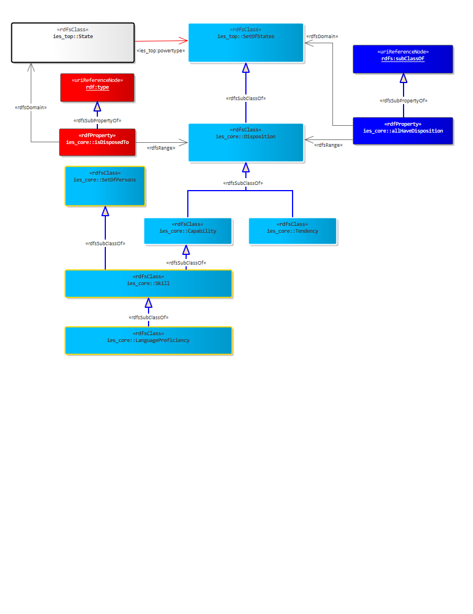

### IES elements in this diagram:

* [Disposition](#3a8d029d-e43d-4a16-a220-ee8b4b802aa4)
* [Capability](#36f517d6-27ea-47f0-a8aa-4f92deffd333)
* [Tendency](#6580ef28-1512-4ed7-b321-75e5ecea670a)
* [isDisposedTo](#6cedcd94-0f0c-4407-a2d0-cb7a0bc91ea2)
* [allHaveDisposition](#b6ac8bf8-1060-4fea-b00b-8ad509df69e9)
* [Skill](#90de0c27-8ee7-4e15-92a5-031319613db5)
* [LanguageProficiency](#72dabead-12c8-459f-bfba-7dc588c8dfea)
* [SetOfPersons](#a368032e-957e-46de-adba-535d9062b8e2)
* [SetOfStates](#e25c3b00-4ca3-40f4-9443-15c9dc4ee972)
* [State](#885fc001-7738-47ab-8870-30d004a57180)

A disposition is about a state's capability or tendency to do something or to exhibit a property. It may be that the state has never actually done the thing it is capable of (<i>Capability</i>) - e.g. an aircraft capable of Mach 2 but that has not yet flown that fast. Similarly, a person may have a <i>Tendency</i> towards violence based just on what they say and threaten to do but may not have been violent.
Dispositions are managed in IES-Core using <i>Disposition</i> -a set that collects all states that share the same disposition (e.g. all aircraft capable of Mach 2).

## Stuff and Count
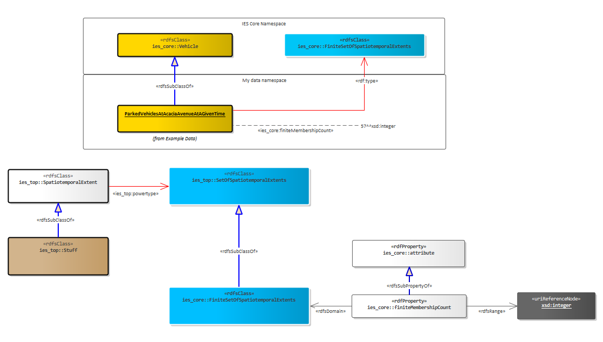

### IES elements in this diagram:

* [Stuff](#0f8a7a2e-896c-4b09-afde-f63807bdc767)
* [SpatiotemporalExtent](#dcb3f671-0fa3-4de6-b037-a011c432a087)
* [FiniteSetOfSpatiotemporalExtents](#8df90785-8066-4e37-a8ff-64d4232cf266)
* [SetOfSpatiotemporalExtents](#0c4a5ca9-a706-4653-ab55-69d2fcab0d23)
* [attribute](#4ac55554-9e8c-43a4-baf8-5cc912a6be07)
* [finiteMembershipCount](#e2e5cdbf-f48f-4f53-b277-9563af930d3f)
* [Vehicle](#2a33309a-f899-469f-8133-db01cfdb5e68)
* [FiniteSetOfSpatiotemporalExtents](#ad58b5e3-152f-92fe-9135-f46140af932c)

There are times where we want to talk about sets of spatiotemporal extents without having to instantiate every individual extent as an instance. Instead, we want to just provide a count of the members of the set e.g. the number of cars in the set parked at Acacia Avenue. Such sets are instances of <i>FiniteSetOfSpatiotemporalExtents</i> where the count is provided using the attribute <i>finiteMembershipCount.</i>
In the illustrated example, to get the set of vehicles parked at Acacia Avenue, we create a subClassOf of the set of Vehicle. This gives us a specific subset of vehicles parked at Acacia Avenue at a time. This subclass is also an instance of <i>FiniteSetOfSpatiotemporalExtents</i> allowing us to assign <i>57</i> as its <i>finiteMembershipCount</i>.
There are physical things in the world that are difficult to call out as separate individuals due to their high divisibility - any division of them yields the same type of thing. For example, water in a swimming pool, sand on a beach or the walls and floors of a building. <i>Stuff</i> allows us to talk about these highly divisible or generally uncountable things.

## Similarity and The Same
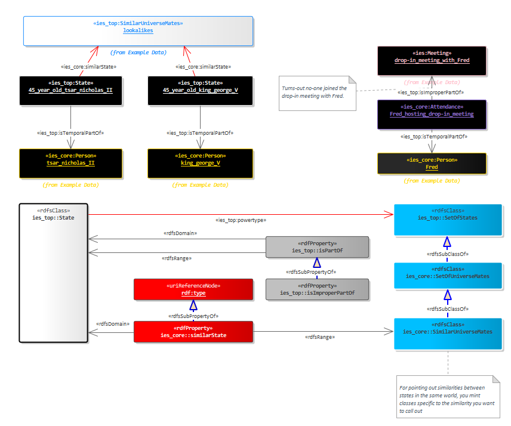

### IES elements in this diagram:

* [isImproperPartOf](#a46e9e64-6238-42d3-96ab-e0ab6c532636)
* [SimilarUniverseMates](#7a24f038-9167-45b3-91c5-7f4ac9729d53)
* [similarState](#d145d3ef-5d69-4ecd-97ba-47dabd663bb5)
* [State](#885fc001-7738-47ab-8870-30d004a57180)
* [SetOfStates](#e25c3b00-4ca3-40f4-9443-15c9dc4ee972)
* [isPartOf](#b51571e4-8ac5-4387-bb47-ab110e15f586)
* [SetOfUniverseMates](#3f29e849-d48b-43ad-8d3c-0dfd553e7625)

Most of the time with non-4D approaches, things that are deemed to be the same, are often, in a 4D-sense, just two states of the same whole-life individual or just two identifiers for the same individual. 
The 4D (extensional) approach gives us a criterion for identifying if two things are genuinely the same - if they occupy precisely the same space at the same time (the same spacetime), they are the SAME THING. Ideally this is reflected in our data, if two things are the same, there should only be one instance. That said, in rare circumstances (usually when data arrives from more than one place), if two things genuinely are the same in a 4D-sense, then, if possible, these should be merged into one, and their original identifiers kept. If not, and when all other approaches are not possible, then the <i>isImproperPartOf</i> property may be used. This relationship is also used when a part is exactly the same as the whole. E.g. A <i>Meeting </i>with a single <i>Attendance </i>part - the attendee's participation is the full spatiotemporal extent of the meeting.
<i>SimilarUniverseMates</i> captures a specific similarity shared by a small number of states rather than a trait found in a larger proportion of a given population. For example, two persons whole resemble each other. It is important to distinguish a <b>Similarity</b> from a <b>Characteristic</b>. If a property applies to a large population of that type e.g. vehicle color or person hairstyle then that is a Characteristic not a Similarity. States are linked to an instance of <i>SimilarUniverseMates</i> using the <i>similarStates</i> property.

## Attributes
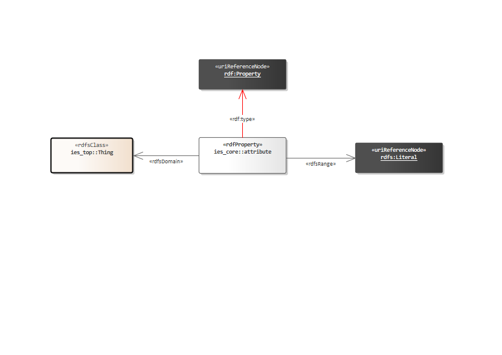

### IES elements in this diagram:

* [Thing](#27c6bcf1-9ffe-4172-ac2c-e32653b43014)
* [attribute](#4ac55554-9e8c-43a4-baf8-5cc912a6be07)

Attributes can be applied to any <i>Thing</i>.
Attributes are RDF properties whose range is an RDF literal. In almost all cases, these literals will be typed by any XML Schema simple datatype - e.g. xsd:string, xsd:double, xsd:dateTime, etc. (refer to W3C XML Schema specification for the complete list).<ins> </ins>
Attributes are used sparingly in IES-Core and generally serve as convenient shortcuts for more complex 4D constructs. Whenever an Attribute appears in the model, it reflects a pragmatic decision to simplify implementation while acknowledging that a fuller, more detailed 4D structure exists behind it.

## Source Reference
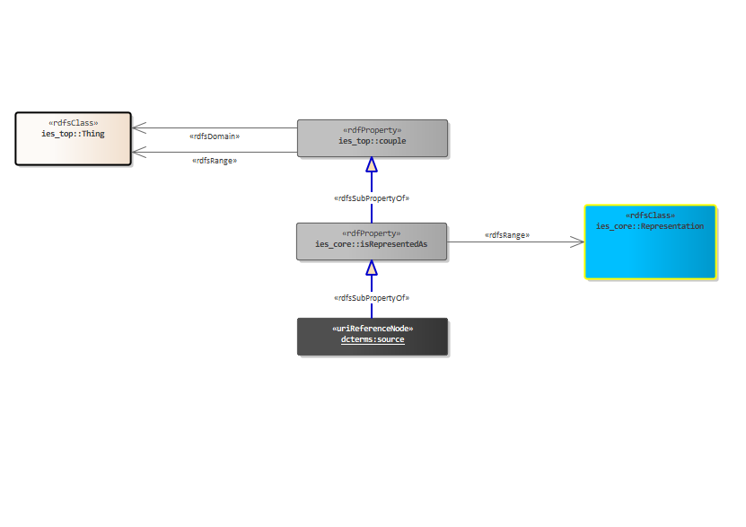

### IES elements in this diagram:

* [Representation](#a4a8f4f5-edc5-48a9-a926-024a25801f5f)
* [isRepresentedAs](#37400026-3e6b-4960-a8e8-832c55ddb10f)
* [couple](#85feafd9-50a0-42ea-9cc7-8dc7b055f47b)
* [Thing](#27c6bcf1-9ffe-4172-ac2c-e32653b43014)

At times it is important to identify the source of information about a <i>Thing</i> in our data. The key relationship here is <i>isRepresentedAs</i>, from the Representation pattern, which asserts that a <i>Representation</i> (e.g., a document, video, or image) conveys something about a <i>Thing</i>.
In some cases, however, we need to be more precise - for example, to indicate that a particular <i>Representation</i> is the source of the information about a <i>Thing</i>. To support this, IES-Core adopts the use of the <i>source</i> relation from the DC Terms ontology which we have grounded within the IES-Core ontology as a sub-property of <i>isRepresentedAs.</i>
Finally,<b><i> </i></b><i>Representations</i> themselves can be organized into larger structures using the <i>inRepresentation</i> relationship.

## Living Organism
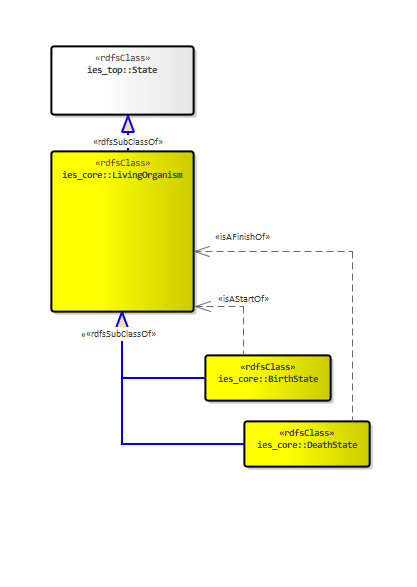

### IES elements in this diagram:

* [State](#885fc001-7738-47ab-8870-30d004a57180)
* [BirthState](#63855454-6ab8-44fb-b61e-83d442b44fd0)
* [DeathState](#31b164c8-443c-4457-a4d3-eabed321fd93)
* [LivingOrganism](#a2c20353-f683-4d31-a7dd-455813527f4b)
* [SetOfLivingOrganisms](#d2e0d19c-d606-4a06-8170-c680ec9734ce)
* [Sex](#310edd2b-0086-4fc7-ba59-46ac001b0ebf)
* [hasSex](#d2c21f1c-52d8-401f-aa8f-369231968235)

A <i>LivingOrganism</i> is a state made up of cells, which uses genes and chemistry to sustain itself, requires energy, and evolves over time. The spatiotemporal extent of an instance of a living organism is bound from its <i>BirthState</i> to its <i>DeathState</i>. These states can be used to indicate the location and time of birth and death of a <i>LivingOrganism </i>respectively.

## Human-made Artefact
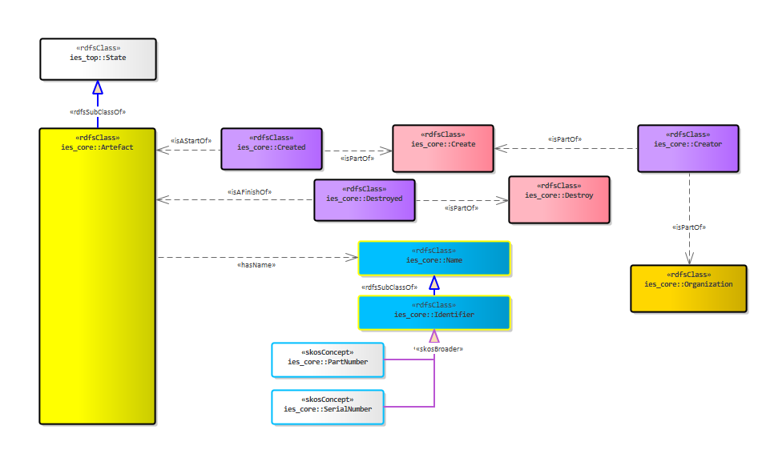

### IES elements in this diagram:

* [Artefact](#221ba44e-7562-4b00-bb1d-7c246d738fe1)
* [Created](#0ab30909-6d5a-4ff0-8456-888c7204054e)
* [Destroyed](#a9ee8f29-2561-4b09-aec0-142de9beb778)
* [Create](#45077eab-0722-43ab-a74b-3f5266739752)
* [Destroy](#848b8a17-00e1-4b76-8246-cb03ad1763bd)
* [State](#885fc001-7738-47ab-8870-30d004a57180)
* [PartNumber](#741940e7-e8c9-4ac5-84d5-587edf94316a)
* [SerialNumber](#ae5d82ec-1024-4f49-ad0d-f7cf7486a296)
* [Identifier](#4357d08f-93d3-4e09-b816-df7226360339)
* [Name](#53e385f5-19e0-431a-970f-e49f3f6e6680)
* [Creator](#4d497045-7245-4ab9-8b9a-3c315cc98211)
* [Organization](#e09d8f52-5b28-4ee6-af3a-935467b8dc45)

An <i>Artefact</i> is a human-made state. The activities of their lifecycle from creation to destruction can be articulated using <i>LifecycleActivity</i> (see the Lifecycle pattern). This is useful to articulate the creator(s) or manufacturer(s) of an <i>Artefact</i>.

## Location
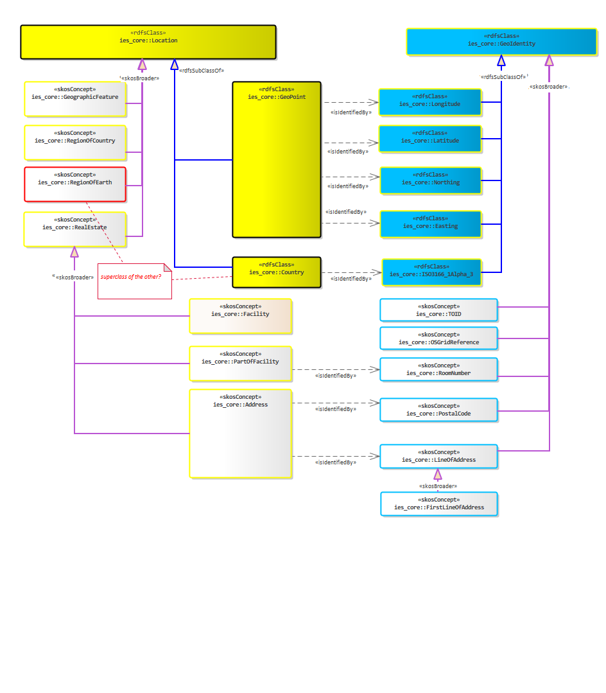

### IES elements in this diagram:

* [Location](#110efc77-c1d2-4eb5-87f6-677f73eb8424)
* [GeoPoint](#80dce57a-8c3c-4e58-8a60-85ca21c4fb44)
* [Country](#4df30ff1-e3cd-4029-82bd-7c826529bada)
* [GeoIdentity](#10996e21-6210-474c-8ad9-a2a2e2302ccc)
* [Longitude](#01997102-4aba-48a7-8cd0-bc3003dbdb30)
* [Latitude](#c21f71b2-d803-4b01-8fc8-75fac81b9fe4)
* [Easting](#8342f87e-ccef-4c4b-871d-143a778257ae)
* [Northing](#aa03b814-d494-4175-afb7-54fa78934989)
* [ISO3166_1Alpha_3](#64a956ae-f567-458a-b64c-9204311970ea)
* [RegionOfCountry](#eb604fc5-9503-4dcb-aa73-e88eab5aad0d)
* [RealEstate](#3d107859-1c19-4568-9d2f-2a4f2a9e4650)
* [Facility](#84c679a1-d3d3-45f3-8764-46ba14b5f242)
* [Address](#b03bbd70-d5f4-48e6-84f2-cb5bbfe1c6ed)
* [PartOfFacility](#22ff57c4-8d8e-4dd9-9a13-c1bf545a76b5)
* [GeographicFeature](#5794c9d0-2074-4b6c-91e8-ae1c647b866f)
* [TOID](#36d10e0e-9301-4295-ad6d-16ef5f9ea82a)
* [LineOfAddress](#e26d69e3-1586-4e97-8ba7-bf38db8283ce)
* [FirstLineOfAddress](#97d37b17-3e40-457b-94d8-2528697b3064)
* [PostalCode](#5aa9b0b5-3219-4d62-b41a-9f3452c8b831)
* [RoomNumber](#327f0797-a422-4456-806c-5aaa1e954f29)
* [OSGridReference](#72710367-542e-48c1-bf36-e3552f80d6fe)
* [RegionOfEarth](#55e04625-48ec-4b77-8150-4c8324594ad5)

THIS PATTERN IS STILL IN DEVELOPMENT AND SUBJECT TO CHANGE IN RELEASE CANDIDATE 2.

## Document
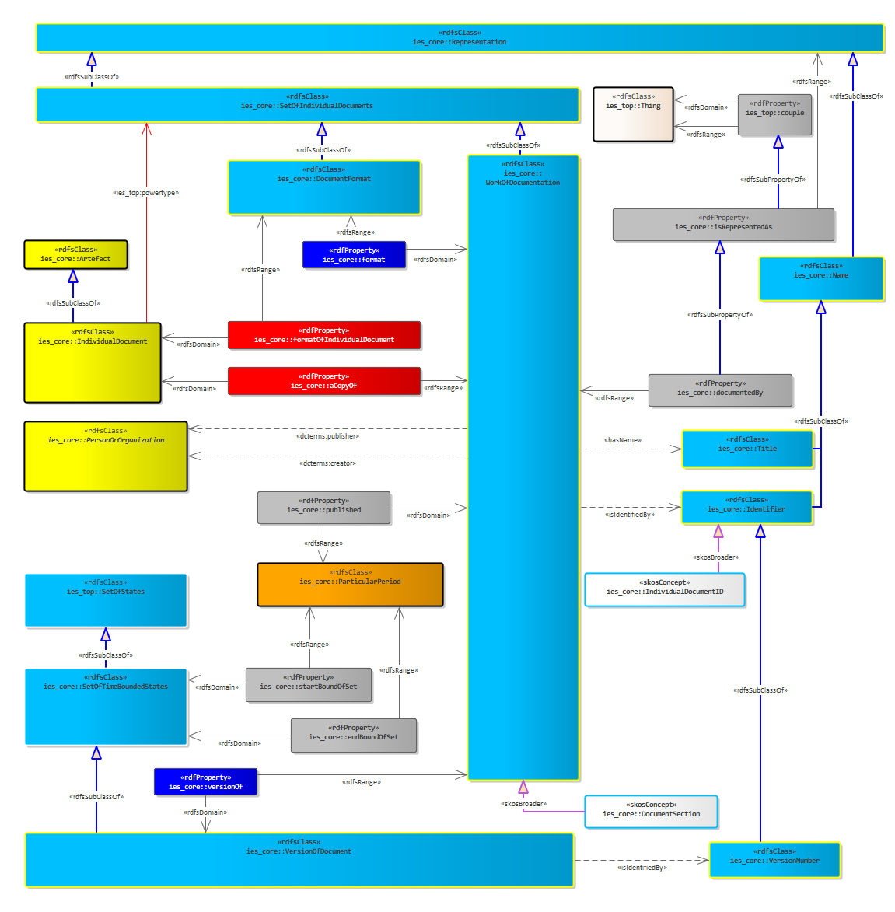

### IES elements in this diagram:

* [IndividualDocument](#54a8e3be-4b61-4362-92f2-3fb021dcd970)
* [WorkOfDocumentation](#068fd872-409b-4565-8ea3-00d9a515ec60)
* [PersonOrOrganization](#cc6c3605-ccf7-4f23-af4c-0be46f1fb5f5)
* [Representation](#a4a8f4f5-edc5-48a9-a926-024a25801f5f)
* [isRepresentedAs](#37400026-3e6b-4960-a8e8-832c55ddb10f)
* [SetOfIndividualDocuments](#a2c3a0dc-2f0d-46ec-9e7e-b7ad443397fc)
* [DocumentFormat](#000c5bd1-f02a-4350-a129-9574e3e9d8f3)
* [Artefact](#221ba44e-7562-4b00-bb1d-7c246d738fe1)
* [documentedBy](#df65005d-f603-4d63-ac78-b8ac8b4b6d74)
* [published](#ddef4a69-71a5-490f-98ce-6e55f8298feb)
* [ParticularPeriod](#244a8229-b9b1-4a12-9d19-aa0eb090397e)
* [VersionOfDocument](#c49821cb-0b40-4cbd-835e-557fdd018663)
* [SetOfTimeBoundedStates](#18182b3f-22e3-4682-a4ce-5bd09e6c3c09)
* [startBoundOfSet](#8343be41-469d-40b8-bff2-1c3b78488d6f)
* [endBoundOfSet](#20732e8a-a42b-4cf5-be38-c005a2be6b46)
* [versionOf](#3f57b7ac-28b9-445d-bb0b-fe4405a6c933)
* [SetOfStates](#e25c3b00-4ca3-40f4-9443-15c9dc4ee972)
* [Name](#53e385f5-19e0-431a-970f-e49f3f6e6680)
* [Identifier](#4357d08f-93d3-4e09-b816-df7226360339)
* [Title](#53d0d18a-d2da-41fd-bd59-9092874411bd)
* [VersionNumber](#b9acf20b-311c-4be0-bfd4-a86912c80692)
* [format](#b7bc6bf3-ac03-49a7-8f2f-65f91d969c5b)
* [formatOfIndividualDocument](#f727b70f-3339-4eaa-a048-9bf9b73434b0)
* [aCopyOf](#afb98a78-7f58-4a5a-9cc0-f140811bccd5)
* [IndividualDocumentID](#83bc3d7e-2609-473c-8ab8-194c531031ab)
* [DocumentSection](#33903533-ff0f-4421-95cc-b57f8508c07e)
* [couple](#85feafd9-50a0-42ea-9cc7-8dc7b055f47b)
* [Thing](#27c6bcf1-9ffe-4172-ac2c-e32653b43014)

IES makes a clear distinction between a specific, individual copy of a document, or just the document in general (of which there may be many copies, written, printed, digitally stored etc.). For example, without this distinction it can be unclear whether "War and Peace" refers to the literary work itself or to a particular personal copy of the book. <i>WorkOfDocumentation </i>provides the general case set of documents of a certain form and <i>IndividualDocument</i> supports the particular instance of a document. In most cases, WorkOfDocumentation will be used. However, when the focus is on a particular instance (e.g. forensics, evidence, or historical interest), IndividualDocument should be used. The <i>IndividualDocument</i> can be linked to the <i>WorkOfDocumentation</i> it is an instance of using the <i>aCopyOf</i> property. IES-Core uses the Dublin Core Terms properties <i>creator</i> and <i>publisher</i> to specify the author and publisher of <i>WorkOfDocumentation</i>.

## Ticket
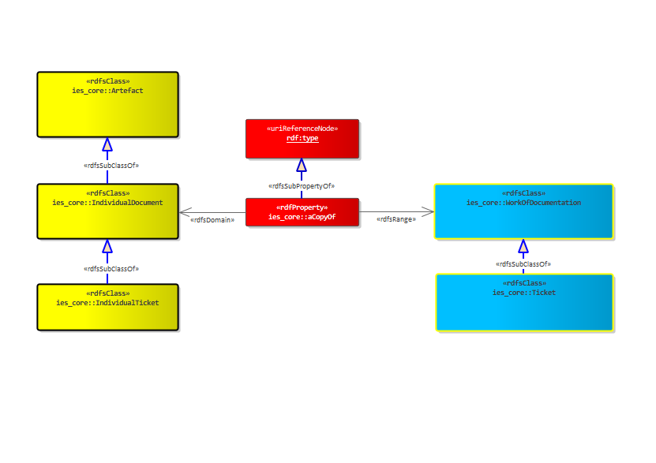

### IES elements in this diagram:

* [Ticket](#068b5b19-170e-4766-959d-2e00e412b568)
* [IndividualDocument](#54a8e3be-4b61-4362-92f2-3fb021dcd970)
* [Artefact](#221ba44e-7562-4b00-bb1d-7c246d738fe1)
* [WorkOfDocumentation](#068fd872-409b-4565-8ea3-00d9a515ec60)
* [IndividualTicket](#ae8d0d1f-ca26-427d-a09c-c76187aeb127)
* [aCopyOf](#afb98a78-7f58-4a5a-9cc0-f140811bccd5)

A <i>Ticket </i>is an <i>WorkOfDocumentation</i> that authorises access to an <i>Activity </i>- e.g. a travel service, entertainment event etc. There are to be used with the Entitlement and Ownership pattern to articulate the Activities or Entitlements they grant access to. In the modern age, there can be multiple copies of the same ticket (<i>IndividualTickets</i>), either printed out or stored on one or many digital devices. The Entitlement pattern assumes that while there can be multiple copies of a ticket, it is normally just one or a few of those individual tickets that grant access.

## System

### Person
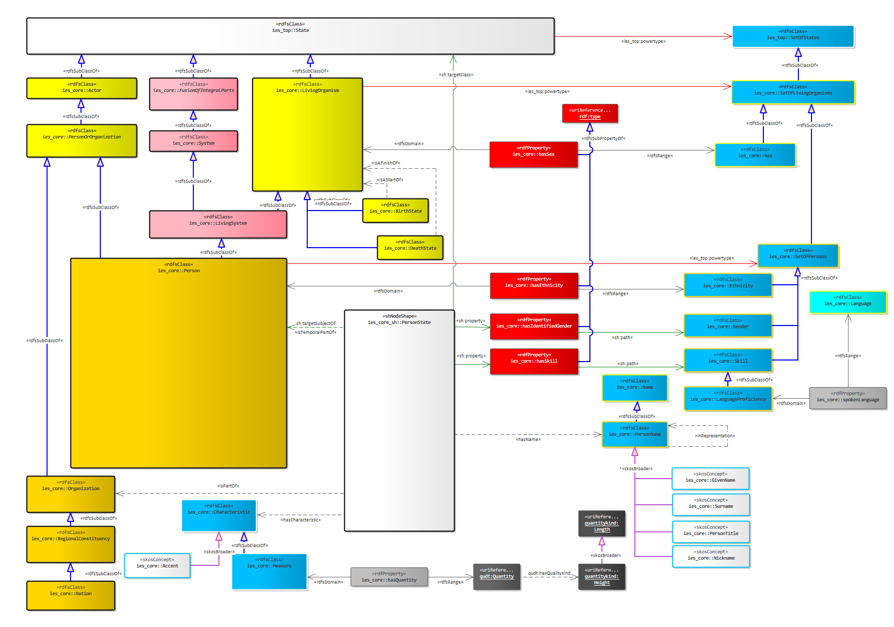

#### IES elements in this diagram:

* [State](#885fc001-7738-47ab-8870-30d004a57180)
* [Person](#673a1da9-3a5d-4310-9752-f0899f31de5d)
* [Actor](#91dc289a-74a8-40b9-b737-feaa7424bc6c)
* [LivingOrganism](#a2c20353-f683-4d31-a7dd-455813527f4b)
* [FusionOfIntegralParts](#519227c7-5c84-4ae0-8e44-b6eeb29e4f58)
* [System](#a0cf4d1d-294d-41ca-8baa-b8bc12efe9b2)
* [LivingSystem](#35ca2c27-e7a2-465a-b529-ab9afbb1b25c)
* [PersonState](#dc093146-100b-4e65-a1a5-4040ac785213)
* [Name](#53e385f5-19e0-431a-970f-e49f3f6e6680)
* [PersonName](#7f24585b-f372-4e3b-86c8-c15c702252d7)
* [Gender](#dbe3554a-c118-4520-8966-7a1658f8da01)
* [hasSex](#d2c21f1c-52d8-401f-aa8f-369231968235)
* [hasIdentifiedGender](#0c0a078a-70ef-4f0d-9841-3a3a6a7171e2)
* [SetOfStates](#e25c3b00-4ca3-40f4-9443-15c9dc4ee972)
* [PersonOrOrganization](#cc6c3605-ccf7-4f23-af4c-0be46f1fb5f5)
* [SetOfPersons](#a368032e-957e-46de-adba-535d9062b8e2)
* [Sex](#310edd2b-0086-4fc7-ba59-46ac001b0ebf)
* [hasEthnicity](#4495f6db-149a-4866-b2d3-ceed4324ff1d)
* [Ethnicity](#ae3d9f2d-2616-4b33-bc0a-360a947bfefc)
* [Nation](#8adf110d-ef60-4f98-8d29-bdb92ac83537)
* [RegionalConstituency](#de6b8201-3ff0-4dba-9b2a-01bb02dc6ec3)
* [Organization](#e09d8f52-5b28-4ee6-af3a-935467b8dc45)
* [Characteristic](#2085ee5c-09ce-4467-bc60-5bb5c7af4f02)
* [hasSkill](#ee39e108-9618-4d52-9e32-e4b4382aef4a)
* [Skill](#90de0c27-8ee7-4e15-92a5-031319613db5)
* [LanguageProficiency](#72dabead-12c8-459f-bfba-7dc588c8dfea)
* [Measure](#39c677c9-089d-48ea-bc7e-dbfc894282ca)
* [hasQuantity](#6f9353e2-2cfa-4017-a2af-3359ad131039)
* [SetOfLivingOrganisms](#d2e0d19c-d606-4a06-8170-c680ec9734ce)
* [Accent](#f07caca3-30f9-45ac-b35a-d53854355196)
* [Surname](#ee38c8df-437f-46cc-92f5-45bd93724afe)
* [GivenName](#499125cc-b0fa-4f75-983e-bfdf36942efb)
* [Nickname](#689655c6-d1ed-454a-ad88-cddd7e34668c)
* [PersonTitle](#b42cfb5b-1501-4d8d-9a14-5e21286fc371)
* [BirthState](#63855454-6ab8-44fb-b61e-83d442b44fd0)
* [DeathState](#31b164c8-443c-4457-a4d3-eabed321fd93)
* [spokenLanguage](#4efe40ac-08c0-40b7-bc68-b11d0306ee78)
* [Language](#33330343-4547-4cf1-9277-f2eb5548724f)

This diagram covers people, and people pretending to be other people (aliases). Most personal attributes belong to a temporal part of a <i>Person</i>, as they are things that can change throughout the person's life. There are properties that cannot change e.g. their <i>Ethnicity</i> and their <i>Sex</i>. 
Like all <i>LivingOrganisms, t</i>wo special states are identified - <i>BirthState</i> and <i>DeathState</i> which bound the lifespan of a person and can be used to identify the location and date of birth as well as location and date of death.
In IES-Core the associations of a <i>Person</i> to their nationality, religion or employee are done using <i>isPartOf</i> properties to a <i>Nation</i>, <i>Religion</i> or <i>Organization</i> respectively.

### Organization
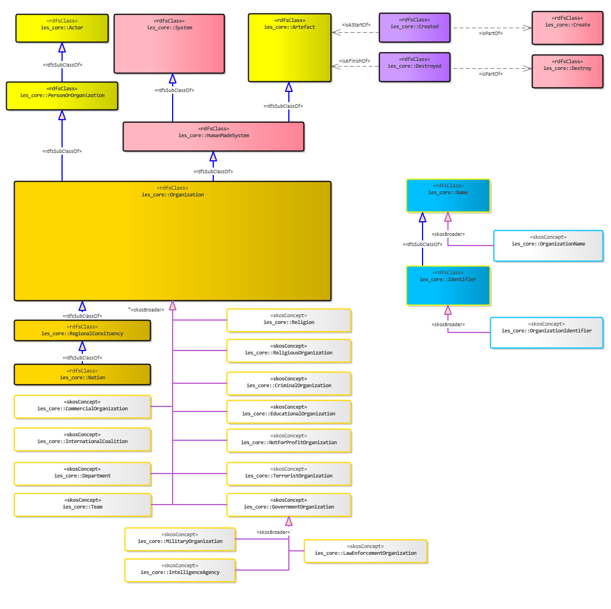

#### IES elements in this diagram:

* [Artefact](#221ba44e-7562-4b00-bb1d-7c246d738fe1)
* [System](#a0cf4d1d-294d-41ca-8baa-b8bc12efe9b2)
* [HumanMadeSystem](#f6b05d87-5fd9-437d-b2b2-366407489912)
* [Organization](#e09d8f52-5b28-4ee6-af3a-935467b8dc45)
* [Nation](#8adf110d-ef60-4f98-8d29-bdb92ac83537)
* [RegionalConstituency](#de6b8201-3ff0-4dba-9b2a-01bb02dc6ec3)
* [PersonOrOrganization](#cc6c3605-ccf7-4f23-af4c-0be46f1fb5f5)
* [Actor](#91dc289a-74a8-40b9-b737-feaa7424bc6c)
* [Create](#45077eab-0722-43ab-a74b-3f5266739752)
* [Destroy](#848b8a17-00e1-4b76-8246-cb03ad1763bd)
* [Created](#0ab30909-6d5a-4ff0-8456-888c7204054e)
* [Destroyed](#a9ee8f29-2561-4b09-aec0-142de9beb778)
* [Religion](#25fc7fb1-c913-4aa5-a195-79851bd26149)
* [ReligiousOrganization](#3435e326-9a16-4cde-b691-b998f89ba6e0)
* [CommercialOrganization](#40afb1ba-d0a5-4690-b877-809437f28819)
* [EducationalOrganization](#1d46d575-3ac3-4793-917c-b06ae53e628a)
* [GovernmentOrganization](#72015c19-d922-47a8-b0a5-d744690f338a)
* [Department](#92961cef-34e6-4bcd-a024-1400a08cc003)
* [Team](#1ee0fdbc-cd86-4bc7-bc55-8c7840593bff)
* [CriminalOrganization](#c35e510d-2e2e-411b-93d3-82330560e729)
* [InternationalCoalition](#c3881149-3b9c-4a78-85fc-17f57e070c1c)
* [LawEnforcementOrganization](#ceb757c2-dfa7-441b-8168-1414ecd7ee0d)
* [IntelligenceAgency](#dad686c5-7e5c-4458-994c-851f93b720bb)
* [MilitaryOrganization](#f70fd007-984d-4f91-9e0e-3b5ee8279a19)
* [NotForProfitOrganization](#614ee53a-7d7e-4ec3-adfe-717993b33ff6)
* [TerroristOrganization](#ea37530e-a5c7-46d4-9a47-68dfb03e843c)
* [OrganizationIdentifier](#8ac8c943-9449-4a10-839b-107b3e5d712f)
* [OrganizationName](#bcbeed33-5dd4-4af8-97d8-a5e784d3cd84)
* [Name](#53e385f5-19e0-431a-970f-e49f3f6e6680)
* [Identifier](#4357d08f-93d3-4e09-b816-df7226360339)
* [Alliance](#1804b042-b78c-48b9-8d52-c872689ffdeb)

In IES-Core, an <i>Organization</i> is a <i>HumanMadeSystem </i>which is a collection of person states. Because of this, an <i>Organization</i> is also an Actor.
An organization can participate in an <i>Activity,</i> but the participation rarely involves the entire organization, i.e. it is not a temporal part of the organization which participates. Instead, it is just a part of the organization which participates.

### Vehicle
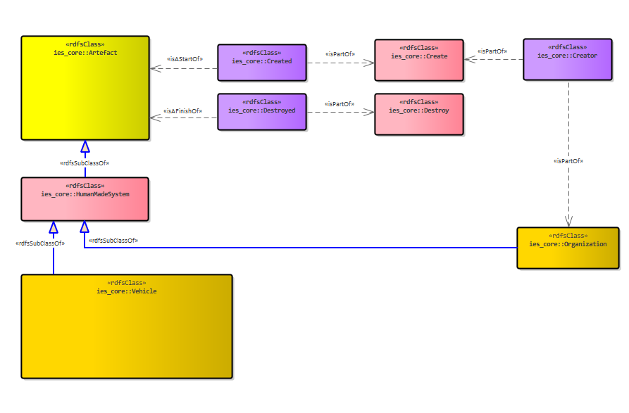

#### IES elements in this diagram:

* [Artefact](#221ba44e-7562-4b00-bb1d-7c246d738fe1)
* [Vehicle](#2a33309a-f899-469f-8133-db01cfdb5e68)
* [HumanMadeSystem](#f6b05d87-5fd9-437d-b2b2-366407489912)
* [Creator](#4d497045-7245-4ab9-8b9a-3c315cc98211)
* [Organization](#e09d8f52-5b28-4ee6-af3a-935467b8dc45)
* [Create](#45077eab-0722-43ab-a74b-3f5266739752)
* [Destroy](#848b8a17-00e1-4b76-8246-cb03ad1763bd)
* [Created](#0ab30909-6d5a-4ff0-8456-888c7204054e)
* [Destroyed](#a9ee8f29-2561-4b09-aec0-142de9beb778)
* [Color](#2fe15680-2107-4262-8c83-5ddd4be22312)

<i>Vehicle</i> is a <i>HumanMadeSystem</i> that provides a means of transportation e.g. car, aircraft, ship.

### Information Processing System
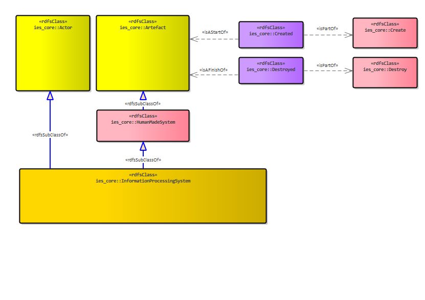

#### IES elements in this diagram:

* [Actor](#91dc289a-74a8-40b9-b737-feaa7424bc6c)
* [InformationProcessingSystem](#b0166f18-6edd-4ec3-bfe2-f19db449e5c1)
* [Artefact](#221ba44e-7562-4b00-bb1d-7c246d738fe1)
* [HumanMadeSystem](#f6b05d87-5fd9-437d-b2b2-366407489912)
* [Create](#45077eab-0722-43ab-a74b-3f5266739752)
* [Destroy](#848b8a17-00e1-4b76-8246-cb03ad1763bd)
* [Created](#0ab30909-6d5a-4ff0-8456-888c7204054e)
* [SetOfInformationProcessingSystems](#322b471c-b825-4862-b974-29a18c211f43)
* [SetOfStates](#e25c3b00-4ca3-40f4-9443-15c9dc4ee972)
* [Destroyed](#a9ee8f29-2561-4b09-aec0-142de9beb778)

An <i>InformationProcessingSystem </i>is a <i>HumanMadeSystem and</i> an <i>Actor</i> which can transform or manipulate information.

## Activity

### Communication and Attendance
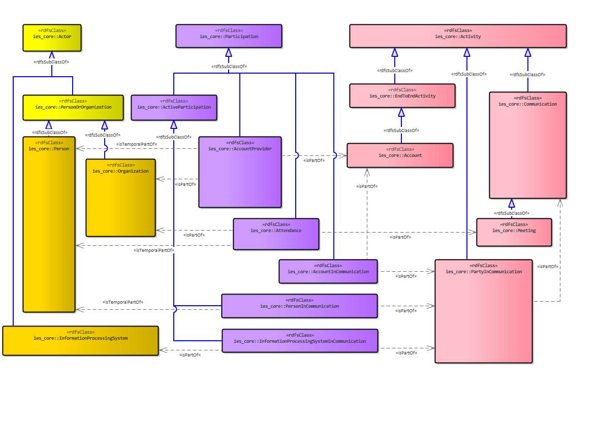

#### IES elements in this diagram:

* [Communication](#7357099c-e2dc-4b87-b970-24df2fabac06)
* [Activity](#443e9eac-efa7-4a34-8299-27822a193d5d)
* [PartyInCommunication](#0b6c41d7-1cbe-4e4d-bf97-71ef8ecc088d)
* [Participation](#b47636e7-e6c4-456f-b755-8ad164240a33)
* [ActiveParticipation](#b3358483-a264-4412-9d00-ba82e3752cd7)
* [PersonInCommunication](#2fc68ab4-c9ca-4f8b-aecf-9c400c43ad1a)
* [InformationProcessingSystemInCommunication](#90e234ad-cc9b-4591-9add-565065c2698d)
* [Account](#7d2bc61d-67e3-423f-9cc1-ab4c6fec8551)
* [AccountProvider](#6ab883d4-3230-48f6-8543-b458e9ec714b)
* [Actor](#91dc289a-74a8-40b9-b737-feaa7424bc6c)
* [PersonOrOrganization](#cc6c3605-ccf7-4f23-af4c-0be46f1fb5f5)
* [Organization](#e09d8f52-5b28-4ee6-af3a-935467b8dc45)
* [Person](#673a1da9-3a5d-4310-9752-f0899f31de5d)
* [InformationProcessingSystem](#b0166f18-6edd-4ec3-bfe2-f19db449e5c1)
* [EndToEndActivity](#a72bc26a-54e4-4531-924e-9d2508ee358b)
* [AccountInCommunication](#5d631dcc-d745-4ddc-9e6b-9efa0b07da3e)
* [Meeting](#d3b045b1-2135-4cec-9a1f-2986d9038ee7)
* [Attendance](#ee89f97e-f3a5-4ef3-a73e-646e0db70684)

The <i>Communication</i> activity can be used for communication that happens in the same space i.e. a <i>Meeting</i> or across space e.g. a phone call, correspondence using email or a physical letter. The latter type sometimes requires additional structure to group together information about the roles in the communication. This is achieved with a <i>Communication</i> consisting of two or more <i>PartyInCommunication</i> activities - which each represent those roles e.g. caller, callee, sender, recipient, teleconference host etc. A <i>PartyInCommunication</i> may involve the participation of people, accounts or devices (<i>InformationProcessingSystems</i>).

### Account
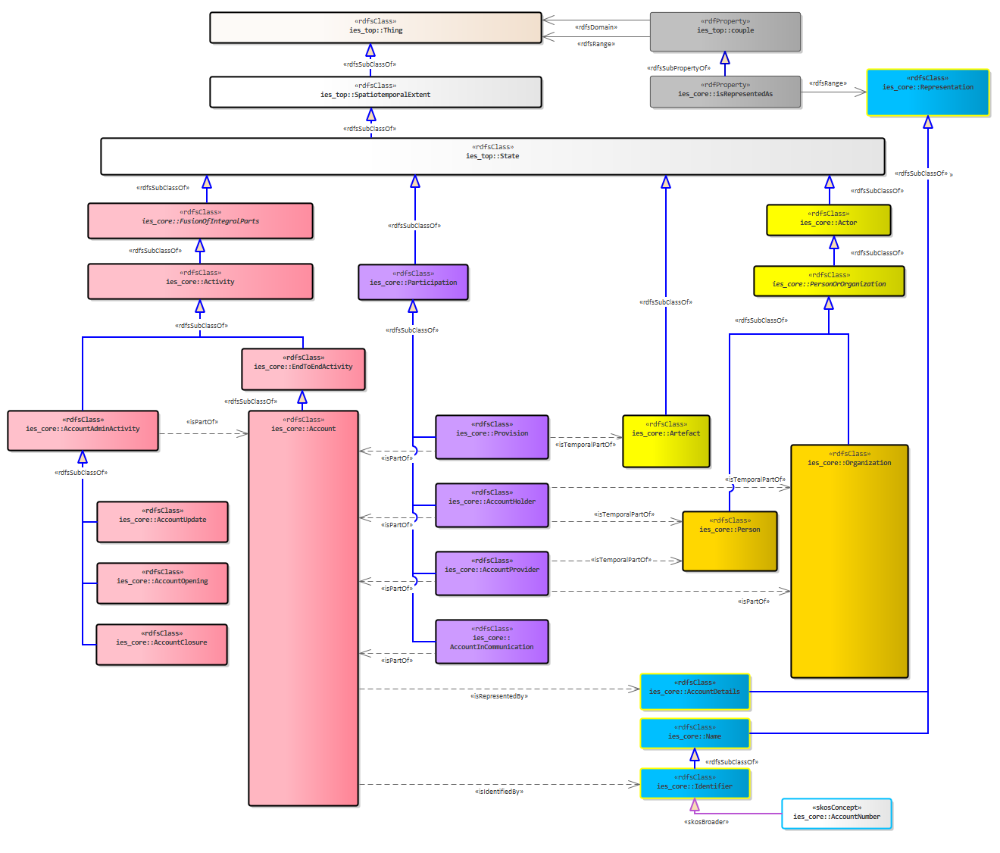

#### IES elements in this diagram:

* [Actor](#91dc289a-74a8-40b9-b737-feaa7424bc6c)
* [State](#885fc001-7738-47ab-8870-30d004a57180)
* [Participation](#b47636e7-e6c4-456f-b755-8ad164240a33)
* [Account](#7d2bc61d-67e3-423f-9cc1-ab4c6fec8551)
* [AccountHolder](#e682fbfe-6589-4f3e-af50-1bdc3344e4f1)
* [AccountProvider](#6ab883d4-3230-48f6-8543-b458e9ec714b)
* [Organization](#e09d8f52-5b28-4ee6-af3a-935467b8dc45)
* [Person](#673a1da9-3a5d-4310-9752-f0899f31de5d)
* [PersonOrOrganization](#cc6c3605-ccf7-4f23-af4c-0be46f1fb5f5)
* [EndToEndActivity](#a72bc26a-54e4-4531-924e-9d2508ee358b)
* [Representation](#a4a8f4f5-edc5-48a9-a926-024a25801f5f)
* [AccountDetails](#f3b91341-7a4c-4fb0-b21a-7b3333ecbed3)
* [Name](#53e385f5-19e0-431a-970f-e49f3f6e6680)
* [Identifier](#4357d08f-93d3-4e09-b816-df7226360339)
* [couple](#85feafd9-50a0-42ea-9cc7-8dc7b055f47b)
* [Thing](#27c6bcf1-9ffe-4172-ac2c-e32653b43014)
* [SpatiotemporalExtent](#dcb3f671-0fa3-4de6-b037-a011c432a087)
* [Provision](#d5618a34-72b6-4b6f-a139-e89520ab8d05)
* [AccountOpening](#a97c14c5-3c4a-4935-9b59-ca5612001f53)
* [AccountClosure](#9693758b-a11c-493d-84ce-c80e47ecf18c)
* [AccountUpdate](#5703251e-4516-4888-8d90-3a8336c44ce0)
* [AccountAdminActivity](#f0a99e8e-b116-4925-a50e-0a024d29fccc)
* [Activity](#443e9eac-efa7-4a34-8299-27822a193d5d)
* [AccountNumber](#7d21d4f3-bd4a-4e7b-a34d-6865fa1ec024)
* [FusionOfIntegralParts](#519227c7-5c84-4ae0-8e44-b6eeb29e4f58)
* [isRepresentedAs](#37400026-3e6b-4960-a8e8-832c55ddb10f)
* [Artefact](#221ba44e-7562-4b00-bb1d-7c246d738fe1)
* [AccountInCommunication](#5d631dcc-d745-4ddc-9e6b-9efa0b07da3e)

Accounts are ways to collect together activities which occur in the act of providing a service. The provider of that service is captured by the participation of an <i>AccountProvider</i> and the customer by an <i>AccountHolder</i>. The Exchange pattern can be used alongside <i>Account</i> to articulate what is being exchanged as part of the service e.g. the exchange of a monthly amount of water as part of a monthly billed provision of water to a home. There are also times when an <i>Artefact</i> participates in the provision of a service e.g. a bank card in relation to banking services or a WiFi router for the provision of internet.

### Presence
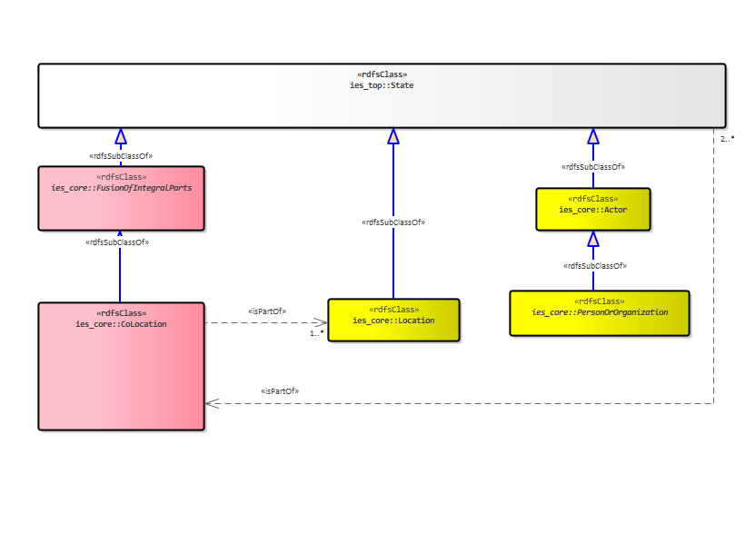

#### IES elements in this diagram:

* [State](#885fc001-7738-47ab-8870-30d004a57180)
* [Actor](#91dc289a-74a8-40b9-b737-feaa7424bc6c)
* [FusionOfIntegralParts](#519227c7-5c84-4ae0-8e44-b6eeb29e4f58)
* [CoLocation](#57160f30-618c-4b30-b817-be952b309052)
* [Location](#110efc77-c1d2-4eb5-87f6-677f73eb8424)
* [PersonOrOrganization](#cc6c3605-ccf7-4f23-af4c-0be46f1fb5f5)

In a 4D ontology, the co-location of two or more individuals is expressed through all those individuals being a part of a location at a given time. However, there are cases where it is useful to explicitly call out co-location for the purpose of querying. This pattern offers a pragmatic solution while remaining consistent with a 4D approach.
In IES-Core, <i>CoLocation </i>is defined as a fusion of states that are deemed to be co-located. A <i>CoLocation </i>instance must contain at least two fused states - each a part of it<i>. </i>Additionally, the instance must be associated with at least one location. More specific locations can be added later if greater precision is needed.

### Entitlement and Ownership
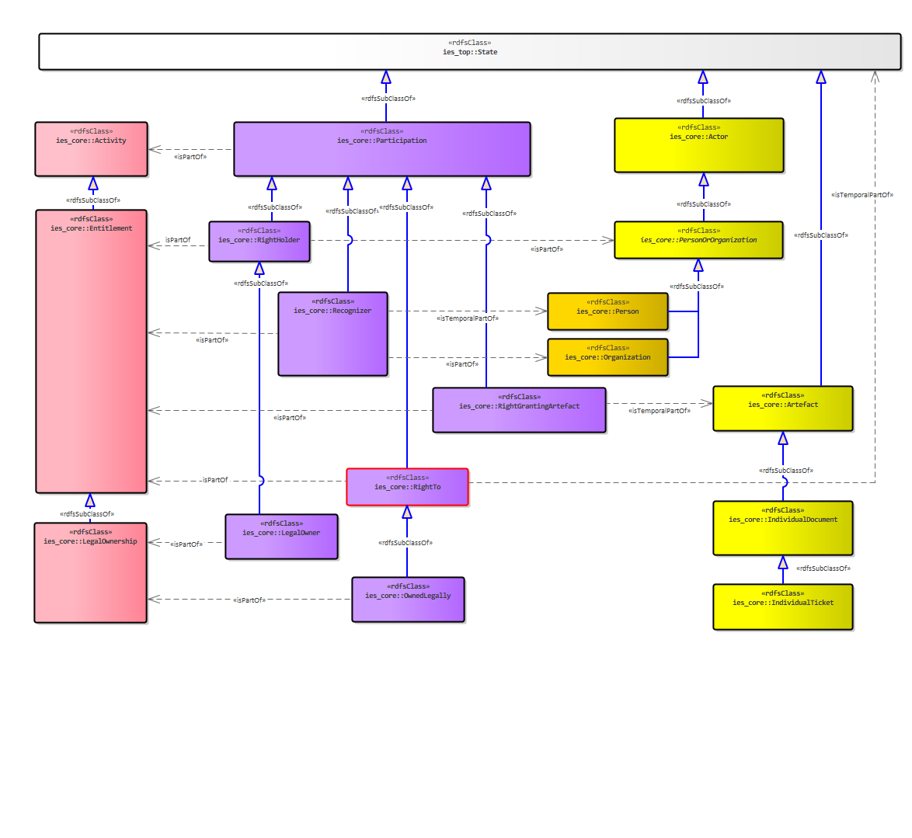

#### IES elements in this diagram:

* [RightTo](#9e747a74-553d-4d62-b0f5-e66afd9679f2)
* [RightHolder](#71f225ee-0dae-4363-9d8e-bc5b34db62f3)
* [Entitlement](#13ca075a-f03a-44b6-acd4-077875503204)
* [PersonOrOrganization](#cc6c3605-ccf7-4f23-af4c-0be46f1fb5f5)
* [Person](#673a1da9-3a5d-4310-9752-f0899f31de5d)
* [Organization](#e09d8f52-5b28-4ee6-af3a-935467b8dc45)
* [Actor](#91dc289a-74a8-40b9-b737-feaa7424bc6c)
* [State](#885fc001-7738-47ab-8870-30d004a57180)
* [LegalOwner](#844d3dfd-ded3-4e8b-918f-9807f6c2e047)
* [OwnedLegally](#d4a2871b-b281-42a1-aa43-b3de9f5123c9)
* [Participation](#b47636e7-e6c4-456f-b755-8ad164240a33)
* [Activity](#443e9eac-efa7-4a34-8299-27822a193d5d)
* [LegalOwnership](#eec532c6-eee0-4e16-a988-00d73ee51c3d)
* [Artefact](#221ba44e-7562-4b00-bb1d-7c246d738fe1)
* [RightGrantingArtefact](#a8b29c2f-f558-48ca-a3d4-7f05d067d384)
* [IndividualTicket](#ae8d0d1f-ca26-427d-a09c-c76187aeb127)
* [IndividualDocument](#54a8e3be-4b61-4362-92f2-3fb021dcd970)
* [Recognizer](#886997cb-23d6-4e9b-a432-769ba6ae0a95)

Expressing the ownership of things is a common use case but it a complex topic.
Strictly speaking, the property or assets of a person or organization is a question of rights. No-one actually owns something; they have a legal right to that thing. 
IES-Core deals with ownership by first dealing with rights, which is an activity of <i>Entitlement</i>. An <i>Entitlement</i> provides a PersonOrOrganization (the RightHolder) the <i>RightTo</i> some <i>State</i>. The right to something involves some party (Organization or Person) to recognize (the Recognizer) that right - this could be the event organizer of a concert or a <i>Nation</i> in the context of a right upheld by that nation's laws.

### Exchange
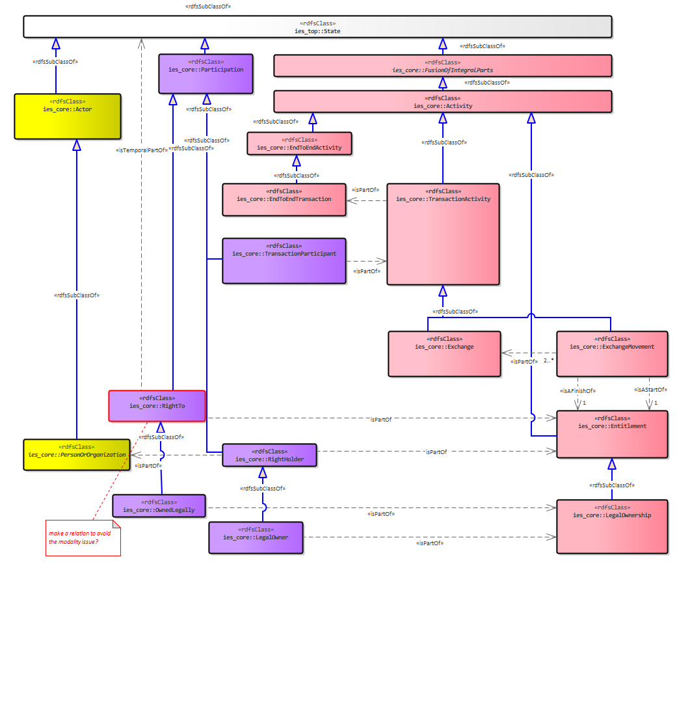

#### IES elements in this diagram:

* [EndToEndTransaction](#e04564db-50fb-467c-8971-d9b4ecdf9586)
* [Activity](#443e9eac-efa7-4a34-8299-27822a193d5d)
* [EndToEndActivity](#a72bc26a-54e4-4531-924e-9d2508ee358b)
* [Exchange](#73b56915-088d-4e49-a34f-503dbc510fae)
* [ExchangeMovement](#d8558615-b5b4-45e0-b8fc-5311a804f8ef)
* [Entitlement](#13ca075a-f03a-44b6-acd4-077875503204)
* [RightHolder](#71f225ee-0dae-4363-9d8e-bc5b34db62f3)
* [RightTo](#9e747a74-553d-4d62-b0f5-e66afd9679f2)
* [Participation](#b47636e7-e6c4-456f-b755-8ad164240a33)
* [TransactionActivity](#5bccfd0d-d48e-4765-83f6-7056d7cd89a2)
* [LegalOwnership](#eec532c6-eee0-4e16-a988-00d73ee51c3d)
* [LegalOwner](#844d3dfd-ded3-4e8b-918f-9807f6c2e047)
* [OwnedLegally](#d4a2871b-b281-42a1-aa43-b3de9f5123c9)
* [State](#885fc001-7738-47ab-8870-30d004a57180)
* [Actor](#91dc289a-74a8-40b9-b737-feaa7424bc6c)
* [PersonOrOrganization](#cc6c3605-ccf7-4f23-af4c-0be46f1fb5f5)
* [FusionOfIntegralParts](#519227c7-5c84-4ae0-8e44-b6eeb29e4f58)
* [TransactionParticipant](#4cf340d7-474d-40d7-9416-102964083670)

When goods or assets are bought or sold - whether exchanged for modern fiat currency or, as in earlier times, for livestock or shells, the same fundamental pattern occurs: a transfer of ownership. An exchange is a change in state of the right-to or ownership-of, all assets involved. For example, purchasing a car for $20,000 ends one party's ownership of the car and begins another's, while the seller's ownership of the $20,000 ends and the buyer's begins.
In IES-Core, this process is represented by an <i>Exchange</i> activity, which consists of at least two <i>ExchangeMovement</i> activities. Each <i>ExchangeMovement</i> marks the conclusion of one entitlement and the creation of another. Because exchanges are typically preceded by related steps such as placing an order or negotiating a price, an <i>Exchange</i> is a form of <i>TransactionActivity</i>, which may be just one part of a broader <i>EndToEndTransaction</i>.

### Movement
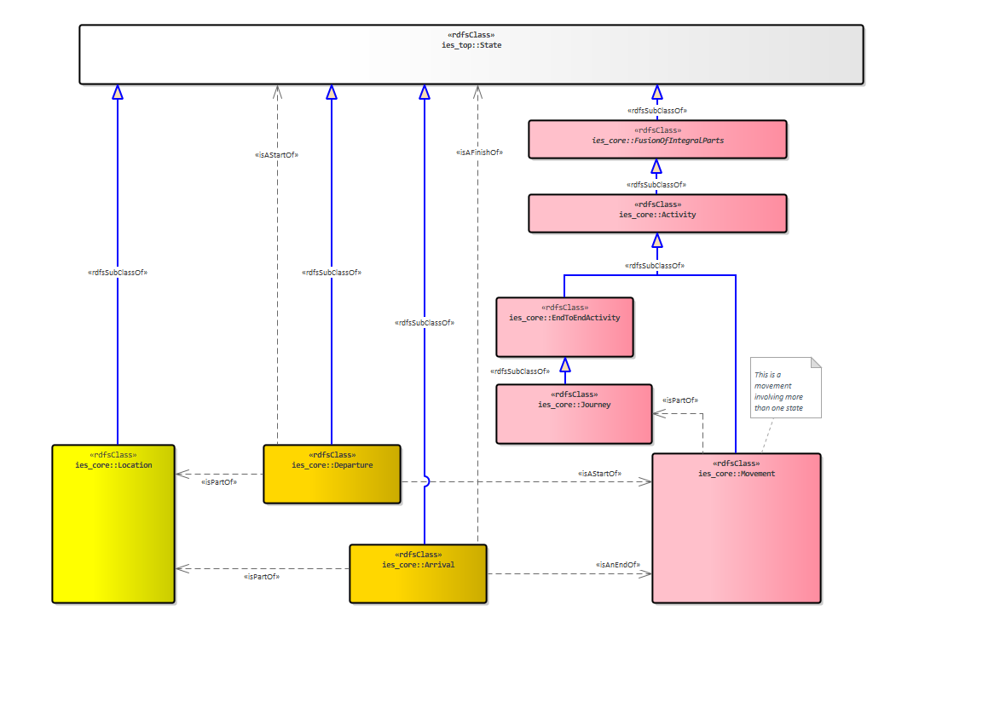

#### IES elements in this diagram:

* [Activity](#443e9eac-efa7-4a34-8299-27822a193d5d)
* [EndToEndActivity](#a72bc26a-54e4-4531-924e-9d2508ee358b)
* [Movement](#5d61d503-bf44-4069-a8e1-0f9cea34ea91)
* [Journey](#52e9683f-dea0-4845-b75c-d2b218f5bb49)
* [Departure](#9d283645-51ed-46ad-8cc5-284c372fcf12)
* [Arrival](#93ed6955-f6b9-4d4e-b174-10550153761a)
* [State](#885fc001-7738-47ab-8870-30d004a57180)
* [Location](#110efc77-c1d2-4eb5-87f6-677f73eb8424)
* [FusionOfIntegralParts](#519227c7-5c84-4ae0-8e44-b6eeb29e4f58)

The travel or movement of a single individual (person or otherwise) from one place to another is articulated using a temporal part (a <i>State</i>) of that individual. This temporal part begins with a <i>Departure</i> state and concludes with an <i>Arrive</i> state. The time and place of where it moves from and time and place where it moves to, can then be asserted by the <i>Location</i> and <i>Period</i> they are part of.
Sometimes we need to describe the coordinated movement of multiple individuals. In such cases, we combine the all the "moving" states into a collective <i>Movement</i> activity.
We can sometime refer to travel as consisting multiple "legs". For example, a trip from New York to Rome might involve an initial flight to London followed by a second flight to Rome. Similarly, a person's commute could include driving to a train station, taking the train, and then walking to the office. The <i>EndToEndActivity</i> of <i>Journey</i> is used to collect together individual <i>Movement</i> activities as parts to support said use case.

### Governance
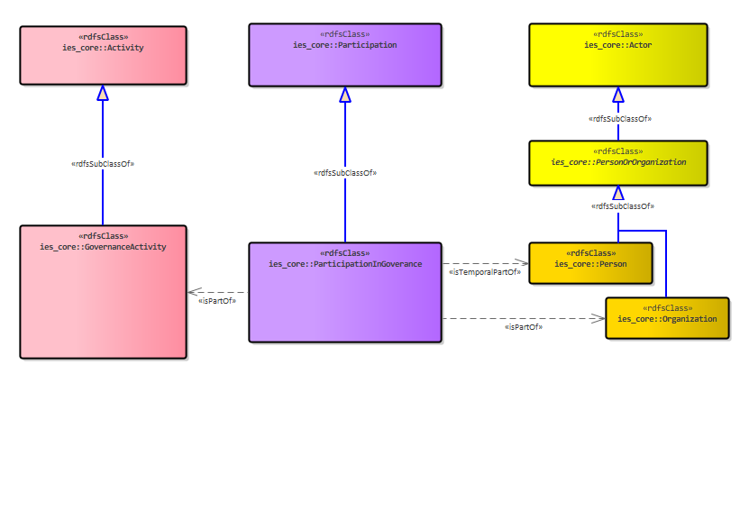

#### IES elements in this diagram:

* [Activity](#443e9eac-efa7-4a34-8299-27822a193d5d)
* [GovernanceActivity](#f39d718a-7d3a-462f-b1ea-8d25ac70901c)
* [Participation](#b47636e7-e6c4-456f-b755-8ad164240a33)
* [ParticipationInGoverance](#20bba6fa-cd95-4232-837e-c49564401315)
* [Person](#673a1da9-3a5d-4310-9752-f0899f31de5d)
* [Actor](#91dc289a-74a8-40b9-b737-feaa7424bc6c)
* [PersonOrOrganization](#cc6c3605-ccf7-4f23-af4c-0be46f1fb5f5)
* [Organization](#e09d8f52-5b28-4ee6-af3a-935467b8dc45)

<i>GovernanceActivities</i> are activities that take place in local or national government, or in intergovernmental interactions.

### Observation
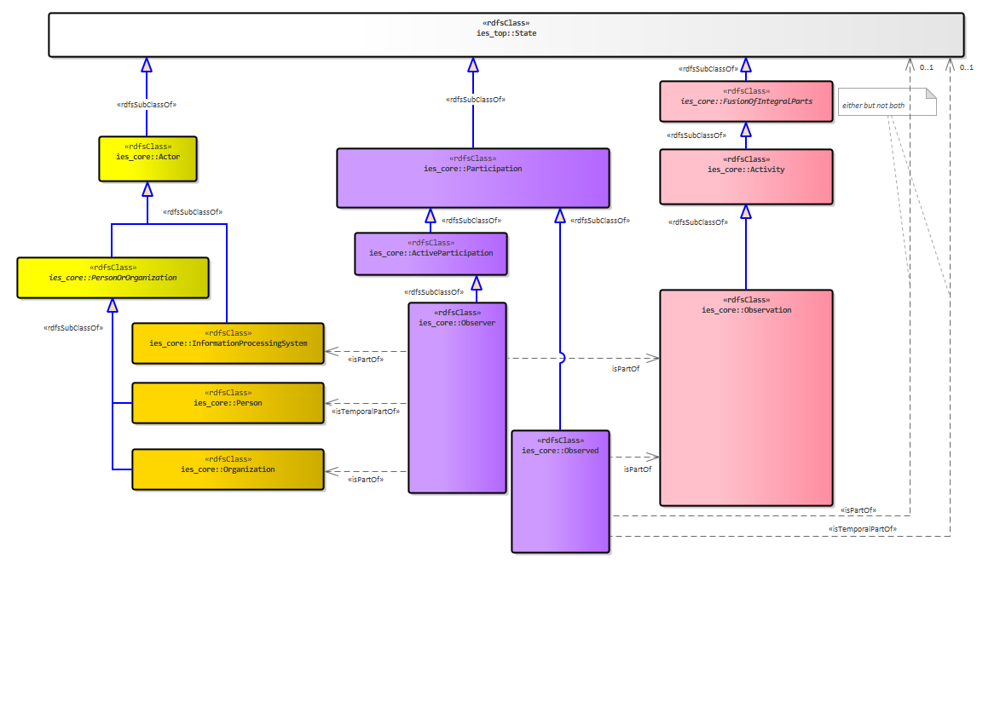

#### IES elements in this diagram:

* [Activity](#443e9eac-efa7-4a34-8299-27822a193d5d)
* [Observation](#0c6d0460-64c1-4f18-9e40-6acf68eff05f)
* [Observer](#df9f0577-950b-4768-87a6-c9f651c0ebf7)
* [Participation](#b47636e7-e6c4-456f-b755-8ad164240a33)
* [Observed](#6740ad35-e10e-4d52-97d0-1c13cee004d6)
* [ActiveParticipation](#b3358483-a264-4412-9d00-ba82e3752cd7)
* [State](#885fc001-7738-47ab-8870-30d004a57180)
* [Actor](#91dc289a-74a8-40b9-b737-feaa7424bc6c)
* [PersonOrOrganization](#cc6c3605-ccf7-4f23-af4c-0be46f1fb5f5)
* [Organization](#e09d8f52-5b28-4ee6-af3a-935467b8dc45)
* [Person](#673a1da9-3a5d-4310-9752-f0899f31de5d)
* [InformationProcessingSystem](#b0166f18-6edd-4ec3-bfe2-f19db449e5c1)
* [FusionOfIntegralParts](#519227c7-5c84-4ae0-8e44-b6eeb29e4f58)

An <i>Observation</i> is an activity which involves an <i>Actor</i>(s) participating as an <i>Observer(s)</i> of any other <i>State(s) </i>(the <i>Observed), which can include other activities.</i> Note that the locations of <i>Observer</i> and <i>Observed</i>, can be different.

### Assessment
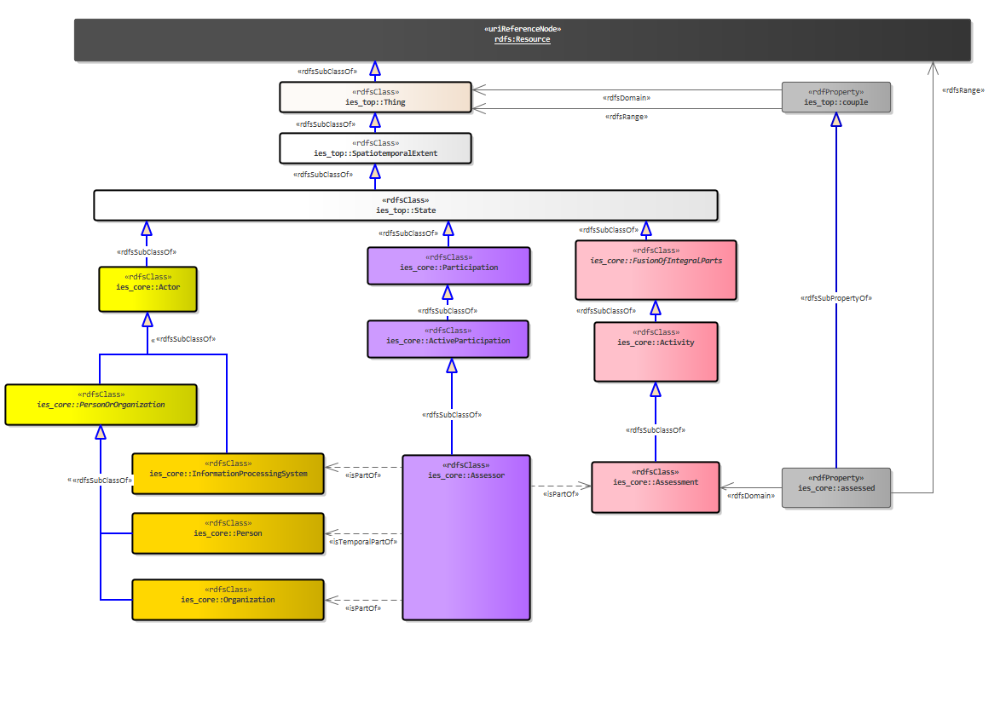

#### IES elements in this diagram:

* [Assessment](#6a1b89bd-af2f-4493-b15c-69fbcca5b702)
* [Activity](#443e9eac-efa7-4a34-8299-27822a193d5d)
* [assessed](#f20f37cf-d03d-4f41-bd19-1fecf02d153d)
* [couple](#85feafd9-50a0-42ea-9cc7-8dc7b055f47b)
* [Participation](#b47636e7-e6c4-456f-b755-8ad164240a33)
* [ActiveParticipation](#b3358483-a264-4412-9d00-ba82e3752cd7)
* [Assessor](#b9f63b51-abdf-4aac-998e-ecc78c8df9fa)
* [State](#885fc001-7738-47ab-8870-30d004a57180)
* [Actor](#91dc289a-74a8-40b9-b737-feaa7424bc6c)
* [PersonOrOrganization](#cc6c3605-ccf7-4f23-af4c-0be46f1fb5f5)
* [Organization](#e09d8f52-5b28-4ee6-af3a-935467b8dc45)
* [Person](#673a1da9-3a5d-4310-9752-f0899f31de5d)
* [InformationProcessingSystem](#b0166f18-6edd-4ec3-bfe2-f19db449e5c1)
* [SpatiotemporalExtent](#dcb3f671-0fa3-4de6-b037-a011c432a087)
* [Thing](#27c6bcf1-9ffe-4172-ac2c-e32653b43014)
* [FusionOfIntegralParts](#519227c7-5c84-4ae0-8e44-b6eeb29e4f58)

In IES-Core, <i>Assessment</i> is an activity in which an <i>Assessor</i> makes some subjective judgement against a thing. This can be a judgement of belief in a thing's possibility, categorization or other qualitative aspect. The thing being assessed can be anything including the intangible e.g. a set or relationship. As a result, it isn't necessarily a participation and therefore it is modelled as a property of the <i>Assessment</i> called <i>assessed</i>.
This pattern shall be extended using SKOS taxonomies to satisfy requirements for the different sorts of assessments users might need.

### Access
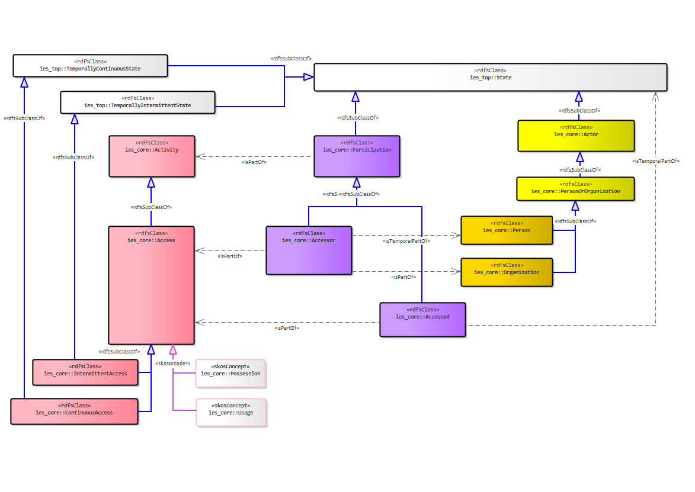

#### IES elements in this diagram:

* [Actor](#91dc289a-74a8-40b9-b737-feaa7424bc6c)
* [State](#885fc001-7738-47ab-8870-30d004a57180)
* [Participation](#b47636e7-e6c4-456f-b755-8ad164240a33)
* [Activity](#443e9eac-efa7-4a34-8299-27822a193d5d)
* [Access](#9c157ce3-5a00-47e1-a35d-6784bcf9b107)
* [Accessed](#85c92cb5-05de-46e4-a29a-21f24765f447)
* [Accessor](#c258cf5f-a167-4864-aff9-cb9d680ef826)
* [Organization](#e09d8f52-5b28-4ee6-af3a-935467b8dc45)
* [Person](#673a1da9-3a5d-4310-9752-f0899f31de5d)
* [PersonOrOrganization](#cc6c3605-ccf7-4f23-af4c-0be46f1fb5f5)
* [TemporallyContinuousState](#01fbe830-dc8b-4c9d-8cda-d8d2bfd22dfe)
* [TemporallyIntermittentState](#54795bb4-0a44-4837-ad45-2e51ede3dd2f)
* [Usage](#2d2db9cc-7e06-45ca-b239-03603271cb32)
* [Possession](#9da639df-9d82-42c6-85e6-153790f6bdb1)
* [ContinuousAccess](#fb6c0026-742a-461b-a00e-08ef5e662a9d)
* [IntermittentAccess](#ba6ae5da-ab80-41f2-8ca6-d39fcb0f3a86)

Access is an activity in IES-Core which is used for material access to something and not the right to access something - see Entitlement and Ownership pattern for that. Moreover, access is separate to ownership of a thing. The <i>Accessor</i> may well be the legal owner (again, see Entitlement and Ownership pattern) but may also be a result of borrowing, temporary custodianship or even unauthorized access or theft.
In most cases, assess can be identified as either the activity of <i>ContinuousAccess</i> (the one-off use of a computer at a library) or <i>IntermittentAccess</i> (occasional use of the neighbour's lawnmower). The superclass, <i>Access</i> shall only be used in the rare cases where the temporal nature of the access is unknown.

### Lifecycle
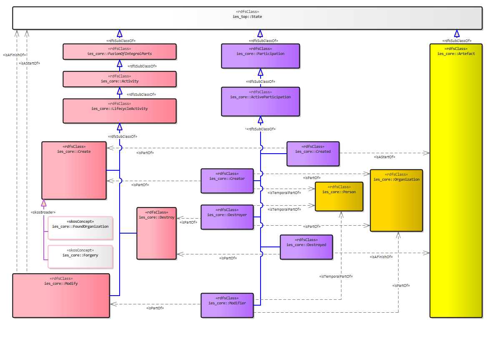

#### IES elements in this diagram:

* [Organization](#e09d8f52-5b28-4ee6-af3a-935467b8dc45)
* [Person](#673a1da9-3a5d-4310-9752-f0899f31de5d)
* [Creator](#4d497045-7245-4ab9-8b9a-3c315cc98211)
* [Destroyer](#c05d2239-7ffb-4d27-918d-954da01a1d78)
* [Participation](#b47636e7-e6c4-456f-b755-8ad164240a33)
* [LifecycleActivity](#f5d9e309-de5b-4a21-806c-5e1fc24e2304)
* [Destroy](#848b8a17-00e1-4b76-8246-cb03ad1763bd)
* [Create](#45077eab-0722-43ab-a74b-3f5266739752)
* [Activity](#443e9eac-efa7-4a34-8299-27822a193d5d)
* [Destroyed](#a9ee8f29-2561-4b09-aec0-142de9beb778)
* [Created](#0ab30909-6d5a-4ff0-8456-888c7204054e)
* [Artefact](#221ba44e-7562-4b00-bb1d-7c246d738fe1)
* [Modifier](#c34720c0-a432-485d-a44d-19bfae953a9a)
* [ActiveParticipation](#b3358483-a264-4412-9d00-ba82e3752cd7)
* [Modify](#f2955095-992d-4356-8f56-c48422011985)
* [FusionOfIntegralParts](#519227c7-5c84-4ae0-8e44-b6eeb29e4f58)
* [State](#885fc001-7738-47ab-8870-30d004a57180)
* [FoundOrganization](#cfba30c1-9012-43c0-b2c9-4d90a4f5f359)
* [Forgery](#1c20a1d0-4aed-4a17-8f5a-b6b88acf1677)

<i>LifecycleActivity</i> covers the creation, modification and destruction of individual specifically<i> Artefacts</i>. The lifespans of <i>Artefacts</i> are tied to <i>Create</i> and <i>Destroy</i> activities.

## ies_core

### Accent
A Characteristic whose members are people who all share the same national or regional accent

### Access
An activity between a <a href="#100B93CD-937E-4fdd-8851-02D1DC07F5B6"><u>ResponsibleActorState</u></a> and an <a href="#F4EDE167-6F5A-417d-9984-0221CCDF752C"><u>Entity</u></a> they have access to - e.g. a FinancialAccount, CommunicationsDevice, etc. This is material access not having the right to access

### Accessed

### Accessor

### Account
An EndToEndActivity that is the collection of all activities that are part of the act of a providing a service between service provider and service consumer.

### AccountAdminActivity
A <a href="#94CEDBD1-8E3D-4cb4-8155-FBD621DA6A0D"><u>BusinessEvent</u></a> that an <a href="#31BFE794-924E-44e3-942E-ADC9ED19FBA1"><u>Account</u></a> participates in

### AccountClosure
An <a href="#19E90CA4-F0EB-4245-826E-EDC278642B41"><u>AccountAdminEvent</u></a> where an <a href="#31BFE794-924E-44e3-942E-ADC9ED19FBA1"><u>Account</u></a> is shut down.

### AccountDetails

### AccountHolder

### AccountInCommunication

### AccountNumber
The account number for the respective Account

### AccountOpening
An AccountAdminEvent where a new Account is opened

### AccountProvider

### AccountUpdate
An AccountAdminEvent where an Account is modified

### aCopyOf
An <a href="#BBC06281-340F-458f-A057-82193F32C9DD"><u>rdf:type</u></a> <a href="#DCE662F5-7BDB-457e-AE7E-2E5FE43DBA1A"><u>relationship</u></a> that asserts a Document is a copy of WorkOfDocumentation

Note: Document instances are individual physical documents whereas <a href="#F0B48978-D4E4-45a4-8238-091A5B714D82"><u>WorkOfDocumentation</u></a> is the general case of a document - e.g. "War and Peace" vs "my copy of <a href="#D4F568F5-7BC4-489d-94BC-AE1305E5C0C2"><u>War</u></a> and Peace"

### ActiveParticipation
A Participation where the participant is "actively" engaged in the Activity.

### Activity
A fusion of temporal parts participating in an incident of interest. e.g. business meetings, telephone calls, acts of war.

### Actor
An Actor is a bounded spatiotemporal extent whose properties and relations enable causal or intentional effects on other states.

### Address
A <a href="#E1A494ED-D493-44ab-8BF9-ABC6889D4D9A"><u>Location</u></a> that can be specified by a postal address

### allHaveCharacteristic
An rdfs:subClassOf <a href="#DCE662F5-7BDB-457e-AE7E-2E5FE43DBA1A"><u>relationship</u></a> that asserts that all instances of a ClassOfElement share a particular Characteristic or Measure

e.g. all London buses being red, all heavyweight boxers weighing more than 200lbs

### allHaveDisposition

### Alliance
An Organization made up of allies - these could be people or organizations, and the alliance may be quite loose.

### ArbitraryPeriod
A <a href="#3FDFA898-C340-4279-8B3C-275359D5B02D"><u>PeriodOfTime</u></a> for which is not delineated by a particular clock period - e.g. not a year, not a month, not a day, not an hour, etc. Instead it is one which is most clearly specified in terms of start and end that are <a href="#2173F463-524C-457c-B106-51322F64F122"><u>ParticularPeriods</u></a>.

### Arrival

### Artefact
A human-made state.

### assessed
An owl:objectProperty that links an Assessment to the rdfs:Resource that is assessed to be true.

### Assessment
An Activity where an actor makes a subjective judgement against a thing. This can be a judgement of belief in a thing�s possibility, categorization or other qualitative aspect.

Examples include:
- Having 'HIGH' confidence that Anne committed the murder.
- Assessing a statement made in an internet article as being true or false.
- Assessing a house to having an energy performance of 'B'
- Assessing the odds of England winning the World Cup as 20-1

Assessment shall be extended using SKOS taxonomies to satisfy requirements for the different sorts of assessments users might need.

### Assessor
An ActiveParticipation where an Actor assesses something to be true.

### Attendance

### attribute
Attributes are not as widely used in IES, they are only used as pragmatic shortcuts for more philosophically complex structures.

### BirthState
A state at the beginning of a LivingOrganism's spatiotemporal extent.

### Capability
A Disposition where all the instances share the same capability
It may be that the SpatiotemporalExtent has never actually done the thing it is capable of - e.g. an aircraft capable of Mach 2 but that has not yet flown that fast.
Example: Vehicles capable of Mach 2

### category

### Characteristic
A SetOfSpatiotemporalExtents whose instances all share a common property - e.g. they are all the same color, mass, etc. 

### CharacterString

### CoLocation
A <i>FusionOfIntegralParts</i> where the activity is uncertain, but it is known that some states were present

Note: whilst colocation can be easily inferred from data, sometimes it's important to call out specific instances where entities of interest were in the same place at the same time.

### Color
A Characteristic whose members all have the same color

### CommercialOrganization

### Communication
An activity where two or more parties interact and exchange information

### ContinuousAccess

### Contract

### Country
A <a href="#E1A494ED-D493-44ab-8BF9-ABC6889D4D9A"><u>Location</u></a> whose land extent / borders are recognised as a <a href="#92EBA9B9-48C2-4082-9FE5-603977BD6846"><u>Country</u></a> by the International Standards <a href="#1ECB4C6E-6A30-4dc5-A4AC-9A9DF5B6A54F"><u>Organisation</u></a> (ISO)

Note: this is simply the land, any buildings on it, and the airspace and ground beneath as recognised by the ISO definition. It does not include the nationals of the Country, its Government, etc. 

### Create
A LifecycleActivity where a state is brought into existence.

### Created
A State that marks the beginning of a state, usually an Artefact.

### Creator
An <a href="#C5AB420C-1AB6-479a-97E1-4F2FD37725CB"><u>EventParticipant</u></a> where a <a href="#D09EDE21-E862-4ec1-BC0F-045CCE5454A9"><u>ResponsibleActor</u></a> participates in a <a href="#AF60517B-E4EF-48ca-BE0F-56E0A89660FD"><u>Create</u></a> event as a creator

### CriminalOrganization

### DeathState
A state at the conclusion a LivingOrganism's spatiotemporal extent.

### Department

### Departure

### Destroy
A <a href="#FA07AB7A-0EE8-4258-BE8B-260F9A1192A7"><u>LifecycleEvent</u></a> where an <a href="#F4EDE167-6F5A-417d-9984-0221CCDF752C"><u>Entity</u></a> is destroyed

### Destroyed
A state that marks the destruction of a state, usually an Artifact.

### Destroyer
An <a href="#C5AB420C-1AB6-479a-97E1-4F2FD37725CB"><u>EventParticipant</u></a> where a <a href="#D09EDE21-E862-4ec1-BC0F-045CCE5454A9"><u>ResponsibleActor</u></a> participates in a <a href="#27000BBA-F3F9-4355-B466-92CE04477C9B"><u>Destroy</u></a> event as a destroyer

### Disposition
A ClassOfElement whose instances all share the same disposition - e.g. capability or tendency

Example: Vehicles capable of Mach 2

### documentedBy
An isRepresentedAs relationship that asserts a WorkOfDocumentation is about a Thing.

### DocumentFormat
A <a href="#CCC8FA06-CDA8-491d-BFFC-0A88D6A565B1"><u>ClassOfIndividualDocument</u></a> whose members are all of the same document <a href="#EF2C13D4-7106-4799-BB72-7CD47714F257"><u>format</u></a> - e.g.

PDF
MS Word

### DocumentSection
A <a href="#675A5C23-0746-43d0-96D0-AF0DF72CD697"><u>Representation</u></a> that is a section/chapter/paragraph in a <a href="#F0B48978-D4E4-45a4-8238-091A5B714D82"><u>WorkOfDocumentation</u></a>

Note: inRepresentation should be used to associate the DocumentSection with the WorkOfDocumentation or other DocumentSection it is part of.

### duration

### Easting
The GeoIdentity that is a representation of the eastward componrnent of cartesian point on a map - i.e. on a 2D projection of the globe such as a mercator projection.

### EducationalOrganization

### endBoundOfSet
A <a href="#DCE662F5-7BDB-457e-AE7E-2E5FE43DBA1A"><u>relationship</u></a> linking a <a href="#E7A659A5-9059-4ea5-8FAB-8A29AFC47D9A"><u>TimeBoundedClass</u></a> to the <a href="#2173F463-524C-457c-B106-51322F64F122"><u>ParticularPeriod</u></a> that marks the end bound date of its instances

### EndToEndActivity
Must have other activities as parts. An Activity (usually of long duration) whose identity is made up of an integral number of other Activities.

### EndToEndTransaction

### Entitlement

### Ethnicity
A ClassOfPerson whose members all share the same sex

### Exchange

### ExchangeMovement

### Facility
A <a href="#E1A494ED-D493-44ab-8BF9-ABC6889D4D9A"><u>Location</u></a> that is man-made, but is typically larger than an <a href="#C90267B5-77A3-4b79-BD0D-7C50C3F4C333"><u>Address</u></a> (i.e. it may have more than one postal address)

Examples:

Military camps, factories, sports facilities, airports, etc.

### finiteMembershipCount
An integer count of members of a FiniteClassOfElement. 

### FiniteSetOfSpatiotemporalExtents
A SetOfSpatiotemporalExtents whose instances are sets with finite, fixed membership of spatio-temporal extents.

### FirstLineOfAddress
The first line of the Address including the number of the dwelling and the street name.

### Forgery
A Create activity that is the creation of fake artefacts.

### format
The <a href="#EF2C13D4-7106-4799-BB72-7CD47714F257"><u>format</u></a> of the respective WorkOfDocumentation.

Examples:

PDF
MS Word

### formatOfIndividualDocument
The <a href="#EF2C13D4-7106-4799-BB72-7CD47714F257"><u>format</u></a> of the respective IndividualDocument.

Examples:

PDF
Printed

### FoundOrganization
A Create Event where an Organisation is founded

### FusionOfIntegralParts
A State composed of multiple integral parts forming a single, unified spatiotemporal extent representing a composite state of interest.

### Gender
A ClassOfPerson whose members all share the same identified gender

### GeographicFeature
A Location that is a naturally occurring feature on the earth.

### GeoIdentity
A unique Identifier attributed to the respective Location.

### GeoPoint
A <a href="#E1A494ED-D493-44ab-8BF9-ABC6889D4D9A"><u>Location</u></a> that is a point (mathematically speaking, of vanishing volume) on, below or above the surface of the WGS84 spheroid. The distance from the spheroid surface is given by the altitudeInMetres attribute.

### GivenName
A PersonName that is one of the given names of a Person

Note:
A GivenName will often be applied to a <a href="#47301D66-CBD5-4d10-9481-B66966A3F3A2"><u>State</u></a> of the Person, as names tend to change over time

### GovernanceActivity
An Event related to democratic processes or party politics

### GovernmentOrganization

### hasAssociatedRepresentation
Use with care, this is meant to relate representations that are referred by or mentioned by a Thing but which they are not representations of that Thing.

### hasCharacteristic
An <a href="#BBC06281-340F-458f-A057-82193F32C9DD"><u>rdf:type</u></a> <a href="#DCE662F5-7BDB-457e-AE7E-2E5FE43DBA1A"><u>relationship</u></a> that asserts an Element has a Characteristic or Measure

### hasEthnicity
The ethnic group that the respective <a href="#5D5C5B9B-5E90-4100-8353-8EE9F3D772E2"><u>Person</u></a> belongs to.

The Metropolitan Police standard shall be used as the reference data standard.

### hasGeoSparqlRepresentation

### hasICalRepresentation

### hasIdentifiedGender

### hasName

### hasQuantity
An <a href="#D106A0A9-55C4-454f-9E20-35BA54114036"><u>isRepresentedAs</u></a> <a href="#DCE662F5-7BDB-457e-AE7E-2E5FE43DBA1A"><u>relationship</u></a> that points to a qudt:Quantity which represents a Measure
Note: a given Measure may have more than quantity associated to it(e.g. 1kg or 2.2lbs) in different units of measure.

### hasSex

### hasSkill

### hasTheme
A couple linking an Activity to a <u>Thing</u> that is a theme (or topic).

Examples:
* An Activity being investigated <a href="#FA4DDF04-16DA-4b5c-AE9A-6AB8CD07DCDB"><u>after</u></a> it occurred.
* A general investigation into a Location.
* A Meeting discussing a new project
* A <a href="#F186E39F-A251-4b84-85E9-577C7290F6D9"><u>VoiceCall</u></a> about a <a href="#3B916F09-F3F4-43e9-9C84-99009C685396"><u>Vehicle</u></a>.

### HumanMadeSystem
A system that is also an Artefact.

### ICalRepresentation

### Identifier
A <a href="#7D7CC966-56EB-4220-A650-A993E598F2E2"><u>Name</u></a> that is unique within the specified context.

### IndividualDocument
An Artefact that is a written, photographed or drawn representation of thoughts. This might include, but not limited to, formal reports, books, legal instruments. Such documents might exist in a wide variety of forms, both printed and in electronic form.

Note: this is an individual document  - i.e. physical or (rarely) a specific electronic copy (e.g. on a specific hard disk...told you it was rare). In most cases, we refer to the document in general - <a href="#F0B48978-D4E4-45a4-8238-091A5B714D82"><u>WorkOfDocumentation</u></a> 

### IndividualDocumentID
An Identifier used to uniquely identify an <a href="#0F327324-6B4E-40b1-B96B-97A334BA5E4A"><u>IndividualDocument</u></a>

### IndividualTicket

### InformationProcessingSystem
InformationProcessingSystem represents any technical or computational system capable of receiving, storing, manipulating, or transmitting information.

### InformationProcessingSystemInCommunication
A <a href="#115F2F9B-21F3-4903-8EAA-AB3AEFE97461"><u>Device</u></a><u>State</u> (and an EventParticipant) when a Device is communicating. 

### inLanguage
An <a href="#BBC06281-340F-458f-A057-82193F32C9DD"><u>rdf:type</u></a> <a href="#DCE662F5-7BDB-457e-AE7E-2E5FE43DBA1A"><u>relationship</u></a> that asserts a <a href="#675A5C23-0746-43d0-96D0-AF0DF72CD697"><u>Representation</u></a> is in a particular <a href="#82652FF5-258F-459c-BC7F-6DAC65E1ECA1"><u>Language</u></a>

### inRepresentation

### Installed
A temporal part which fulfils a ReplaceableLifespan.

### IntelligenceAgency

### IntermittentAccess

### InternationalCoalition

### isDisposedTo

### isIdentifiedBy
A <a href="#C3A36E36-0C73-4af7-88E3-81C9243CE456"><u>hasName</u></a> <a href="#DCE662F5-7BDB-457e-AE7E-2E5FE43DBA1A"><u>relationship</u></a> that asserts an <a href="#315E6AD3-F2DA-4f69-864F-DA2B95121E2E"><u>Identifier</u></a> identifies a <u>Thing</u>

### ISO3166_1Alpha_3
ISO 3166-1 alpha 3 (3-Letter <a href="#92EBA9B9-48C2-4082-9FE5-603977BD6846"><u>Country</u></a> Code)

### iso8601DurationRepresentation
A ISO8601 duration (as <a href="#57843280-4451-47eb-9616-B0843FE4E2C5"><u>xsd:duration</u></a>) that represents the duration of states within this set. 

This representation is also encoded in the URI of the SetOfStatesWithParticularDuration, this is an additional required <a href="#4A8E5877-32DF-428f-9A60-6AC3D083FFCA"><u>attribute</u></a> to enable querying by duration and SPARQL temporal operations.

### iso8601PeriodRepresentation
A ISO8601 datetime that represents the ParticularPeriod. 

This representation is also encoded in the URI of the period, this is an additional required <a href="#4A8E5877-32DF-428f-9A60-6AC3D083FFCA"><u>attribute</u></a> to enable querying by dateTime and SPARQL temporal operations. The literal string shall be encoded in UTC (Coordinated Universal Time) but unlike the URI, it must be punctuated. For example: "2007-01-18T15:30:00"

### isRepresentedAs
A couple that asserts a <a href="#675A5C23-0746-43d0-96D0-AF0DF72CD697"><u>Representation</u></a> is part of another Representation

### Journey
An EndToEndActivity<u> </u>which is made up of two or more Movements

### Language
A SetOfRepresentations that is a spoken or written form of human communication

### LanguageProficiency
A <a href="#92CDC810-9DFA-476b-A2E7-33121F65905B"><u>ClassOfPersonState</u></a> indicating the proficiency a person has in a particular language at that state in their life.

### Latitude
The GeoIdentity that is a representation of the eastward componrnent of cartesian point on a map - i.e. on a 2D projection of the globe such as a mercator projection.

### LawEnforcementOrganization

### LegalOwner

### LegalOwnership
An activity between an Actor and the state they own as per some legal document

### LifecycleActivity
An Activity that brings about change to a state - e.g. creation, destruction or modification.

### LineOfAddress
A line in an Address. There may be any number of these.

### LivingOrganism
A State that is a self-sustaining, cellular, and genetically organized spatiotemporal extent capable of metabolism, adaptation, and reproduction. 

### LivingSystem
A System that is also a Living Organism, composed of interdependent subsystems that collectively sustain, regulate, and reproduce the organism as a unified spatiotemporal extent.

### Location
A geographic place which specifies a point or an area on the Earth's surface or elsewhere

### Longitude
The GeoIdentity that is a decimal representation of an angle of longitude of a <a href="#9A9467C3-D5FC-4964-8943-FE63ADF38914"><u>PointOnEarthSurface</u></a> (WGS84)

### Measure
An Characteristic which is measurable on a scale

### Meeting
An activity where the attendees communicate with each other either in the same space or across space e.g. virtual meeting.

### MilitaryOrganization

### Modifier
An <a href="#C5AB420C-1AB6-479a-97E1-4F2FD37725CB"><u>EventParticipant</u></a> where a <a href="#D09EDE21-E862-4ec1-BC0F-045CCE5454A9"><u>ResponsibleActor</u></a> participates in a <a href="#3EF09CE4-79B0-42be-9AA1-12B97611BF2B"><u>Modify</u></a> event as a modifier

### Modify
A LifecycleEvent where something is changed

### Movement
An Activity where an <a href="#F4EDE167-6F5A-417d-9984-0221CCDF752C"><u>Entity</u></a> moves from one place to another.

### Name
A <a href="#675A5C23-0746-43d0-96D0-AF0DF72CD697"><u>Representation</u></a> that is used to refer to something, usually in context of a NamingScheme.

Examples:
"Michael Caine"  - stage name for Maurice Micklewhite

### NamingScheme

### Nation
The people of a <a href="#92EBA9B9-48C2-4082-9FE5-603977BD6846"><u>Country</u></a> (or group of Countries recognised as a Nation).

Note: this is distinct to a Country which is the land mass under control by the Nation, though ISO Country codes are regularly used to also identify Nations. 

### Nickname
A PersonName that is an unofficial or casual name

Note:
An nickname will often be applied to a <a href="#47301D66-CBD5-4d10-9481-B66966A3F3A2"><u>State</u></a> of the Person, as these tend to be non-permanent names

### Northing
The GeoIdentity that is a representation of the eastward componrnent of cartesian point on a map - i.e. on a 2D projection of the globe such as a mercator projection.

### NotForProfitOrganization

### Observation
An Event where a State is observed by another State (e.g. a Person or InformationProcessingSystem).

### Observed
A Participantion of the thing being observed

### Observer

### Organization
An Actor  whose coordinated human members form a unified, responsible actor within a shared spatiotemporal extent. Can be considered a fusion of states of persons which is both as a collective a responsible actor and a human-made system.

### OrganizationIdentifier

### OrganizationName

### OSGridReference
A GeoIdentity that is an Ordnance Survey Grid Reference - i.e. pertaining to Great Britain.

### OwnedLegally

### Participation
A temporal part which participates in an Activity.

### ParticipationInGoverance

### ParticularPeriod
A Period that is a specific, contiguous extent of time.
IMPORTANT NOTE: The URI of a <a href="#2173F463-524C-457c-B106-51322F64F122"><u>ParticularPeriod</u></a> shall be encoded in UTC (Coordinated Universal Time) and as follows:
http://iso8601.iso.org/20070118T153000
Where the content <a href="#FA4DDF04-16DA-4b5c-AE9A-6AB8CD07DCDB"><u>after</u></a> the / is encoded without punctuation and without the trailing "Z". In the example above, the punctuated equivalent would be "2007-01-18T15:30:00Z"
The reason behind using a URI is that receiving systems can resolve the periods of time and de-duplicate. 
Examples:
Tuesday 28th August 2018
2016
December 1944

### PartNumber
A unique Identifier for the a HumanMadeSystem. Note:  this is different to a serial number which is unique to each HumanMadeSystem.

### PartOfFacility
A <a href="#E1A494ED-D493-44ab-8BF9-ABC6889D4D9A"><u>Location</u></a> that is contained within a Facility - e.g. a room, laboratory, floor, etc.

### PartyInCommunication
An Activity that is part of (usually one end of) a <a href="#6698805F-F492-4f1f-954C-E1EB3C53E148"><u>Communication</u></a> .

Sometimes, all we know about a <a href="#A5713B2C-E098-4dd2-BD46-42DA51899FEA"><u>PartyInCommunication</u></a> is their <a href="#A82378B9-9774-46b9-9845-CC75BE882F06"><u>CommunicationsIdentifier</u></a> (phone number, e-mail address, maybe even just an IP address) so the <a href="#FBA54EEF-91BF-4ba2-8B67-79C899963149"><u>isIdentifiedBy</u></a> <a href="#DCE662F5-7BDB-457e-AE7E-2E5FE43DBA1A"><u>relationship</u></a> may be applied to PartyInCommunication

### Person
A human Living Organism and Actor with a spatiotemporally bounded existence from birth to death.

### PersonInCommunication

### PersonName
A <a href="#7D7CC966-56EB-4220-A650-A993E598F2E2"><u>Name</u></a> used to identify / refer to a Person

Note: this is the full name as known to the organisation managing the NamingScheme. For first names, surnames, etc. use a subtype of PersonName

A <a href="#F114F86C-3BA8-4be7-A686-A1D80002DF28"><u>PersonName</u></a> may be composed of Surname, GivenName, etc. using the <a href="#7238489D-6802-4733-9F7F-9B31D02B3C81"><u>inRepresentation</u></a> <a href="#DCE662F5-7BDB-457e-AE7E-2E5FE43DBA1A"><u>relationship</u></a>

### PersonOrOrganization
An Actor that exists as a spatiotemporally bounded state exhibiting coherent agency, either as a single agent (Person) or as an organized collection of agents (Organization).

### PersonTitle
The title associated with the name of the person.

### Possession
A Relationship between a <a href="#D09EDE21-E862-4ec1-BC0F-045CCE5454A9"><u>ResponsibleActor</u></a> and an <a href="#40231334-5ACC-4dd4-A8C1-05012E2170E0"><u>Asset</u></a> they have in their possession.

Note: this is separate to ownership - e.g. the possessor may well be the owner (use the <a href="#FDD94D9F-F343-4c1b-9688-752C896A3C7C"><u>owns</u></a> relationship) but may also be a result of borrowing, theft, temporary custodianship, 

### PostalCode
A GeoIdentity used to (partially) identify and address

### Provision

### published
ParticularPeriod of publication of the respective document.

### RealEstate

### Recognizer

### RecurringTimespan

### RegionalConstituency
An Organization of human members associated with a specific Location, forming a unified, spatiotemporally bounded collective actor.  The people can be residing or entitled to reside or vote in a particular Location.

### RegionOfCountry
A <a href="#E1A494ED-D493-44ab-8BF9-ABC6889D4D9A"><u>Location</u></a> that is a general subdivision of a Country

e.g. cities, towns, counties, states, etc.

### RegionOfEarth
A <a href="#E1A494ED-D493-44ab-8BF9-ABC6889D4D9A"><u>Location</u></a> that is a general subdivision of the world - e.g. continents, sub-continents, economic areas, etc.

Regions of the world may sometimes be spatially separated (e.g. economic areas)

### Religion

### ReligiousOrganization

### ReplaceableLifespan
A fusion of integral parts that can be installed and uninstalled with its identity  persisting throughout any period of installation or uninstallation. Replaceable lifespans are not inherently integral or dependants of a whole.

### Representation
A SetOfSigns that symbolize or refer to other <i>Things.</i> Examples: 
(1) an identifier used for a Person; 
(2) an photograph of a vehicle; 
(3) a document (though not an individual copy of a document) 
<i>
</i><i>Signs</i> are <i>States</i> that symbolize or refer to other <i>States</i>. They can take many forms: a spoken or written word, a drawing, a printed symbol, or any other communicative mark. In most situations we are not concerned with individual instances of a sign. For example, no single occurrence of the word "IES" in this document, on its own represents the IES ontology. Rather, any occurrences -whether printed on paper, scribbled in a notebook, or stored digitally, conveys the reference. For this reason, the use of SetOfSigns, or more specifically Representations are more useful. An exception might be a specific, unique sign (for example, graffiti on a particular vehicle) where that single occurrence is significant. This differentiation between individual instances of a sign and the collection is useful in regards to documents (See Document for more details).
Sometimes it is important to establish arbitrary categories of Representation - such as "pictures of kittens" or "educational films". A <i>SetOfRepresentations</i> can be used to collect together all Representations of similar content.

### RepresentationScheme

### representationValue
The examplar text, number, etc. of a <a href="#675A5C23-0746-43d0-96D0-AF0DF72CD697"><u>Representation</u></a>

### RightGrantingArtefact

### RightHolder

### RightTo

### RoomNumber

### schemeMasteredIn

### schemeOwner

### SerialNumber
An Identifier for HumanMadeSystem that has been assigned at manufacture. Example Value: 123ABC456DEF.

### SetOfCharacterStrings
The powertype of CharacterString. An instance of this is a set that contains character strings.

### SetOfIndividualDocuments
The powertype of IndividualDocument. An instance of this is a set that contains individual documents.

### SetOfInformationProcessingSystems
The powertype of InformationProcessingSystem. An instance of this is a set that contains information processing systems.

### SetOfLivingOrganisms
The powertype of LivingOrganism. An instance of this is a set that contains living organisms.

### SetOfNames
The powertype of Name. An instance of this is a set of Names. Note that Name itself is a set of character strings.

### SetOfPersons
The powertype of Person. An instance of this is a set that contains persons.

### SetOfRepresentations
The powertype of Representation. An instance of this is a set of Representations. Note that Representation itself is a set of signs.

### SetOfSetOfSigns
The powertype of SetOfSigns. An instance of this is a set that contains sets of signs.

### SetOfSigns
The powertype of Sign. An instance of this is a set that contains signs.

### SetOfStatesWithParticularDuration
A SetOfStates where all members are states with the same temporal duration e.g. all states that are 2 hours and 30 minutes long in duration.

IMPORTANT NOTE: The URI for a SetOfStatesWithParticularDuration must include a valid xsd:duration string. Use the following pattern to construct the full URI:

{{ies-core-namespace}}StateWithDuration{{xsd:duration-representation}}

For example -
http://purl.org/ies/core/v1/ont/StateWithDurationPT2H30M
is the URI for states with a duration of 2 hours and 30 minutes.

The reason behind using such a URI is that receiving systems can resolve the durations and de-duplicate. 

Examples:
States with duration 45 seconds (PT45S)
States with duration 4 days, 12 hours (P4DT12H)
States with duration 1 year, 3 days, 2 hours, 5 minutes (P1Y3DT2H5M)

### SetOfTimeBoundedStates
A <a href="#3C13E07D-5796-4d03-9EBC-C75277E87CA4"><u>ClassOfElement</u></a> whose instances all begin and end within the bounds specified for the Class. In other words, a class that is defined by the temporal extent of its members. 

Note, if either the begin or end bound are missing, it is taken to be indeterminate. For example, if the begin bound is 1st Jan 2018, the class has instances that all started after that date, and their end is irrelevant. 

Example:
Everything that began and ended in the year 1900 - this would include all activities that took place within that year (but did not extend beyond it), everything created and destroyed within that time, and everything that was born and died during the period. 

### SetOfUniverseMates

### Sex
An instance of this is a set of living organisms which share the same sex.

### Sign
An individual utterance (e.g. a spoken word, a written word, a drawn or printed symbol, etc.) that signify a State - i.e. uttered in order to refer to something

### similarState

### SimilarUniverseMates

### Skill

### spokenLanguage
The language in which someone is proficient

### startBoundOfSet
A <a href="#DCE662F5-7BDB-457e-AE7E-2E5FE43DBA1A"><u>relationship</u></a> linking a <a href="#E7A659A5-9059-4ea5-8FAB-8A29AFC47D9A"><u>TimeBoundedClass</u></a> to the <a href="#2173F463-524C-457c-B106-51322F64F122"><u>ParticularPeriod</u></a> that marks the beginning bound date of its instances

### Surname
A PersonName that is their inherited or married name

Note:
A surname will often be applied to a <a href="#47301D66-CBD5-4d10-9481-B66966A3F3A2"><u>State</u></a> of the Person, as names tend to change over time

### System
A Fusion of Integral Parts whose constituent states are functionally or causally interdependent, forming an organized whole whose identity depends on the continued interaction of those parts within a shared spatiotemporal extent.
For example,  a motorized road vehicle - made up of an engine, a chassis and wheels.

### Team

### Tendency
A Disposition where all the instances share the same tendency
Similarly, a Person may be assessed as having a tendency towards violence based just on what they say and threaten to do, but may not have actually been violent.
Example: People who tend to violence

### TerroristOrganization

### Ticket

### Title
The title of the respective document.

### TOID
TOIDs (TOpographic IDentifiers) are unique and persistent identifiers created and managed by Ordnance Survey Great Britain to identify topographic objects in OS datasets. 

Example: the <a href="#79D9049D-E63F-4c94-B348-49506A75B9F8"><u>TOID</u></a> for the Tower of London is osgb1000006032892.

### TransactionActivity

### TransactionParticipant
The parties involves in the transaction. This normally is the same parties which as the RightsHolders to the items which are part of the transaction e.g. those that have the right to sell a set of goods and those that own the money to pay for them.

### Usage
A hasAccessTo relationship between a <a href="#D09EDE21-E862-4ec1-BC0F-045CCE5454A9"><u>ResponsibleActor</u></a> and an <a href="#40231334-5ACC-4dd4-A8C1-05012E2170E0"><u>Asset</u></a> they use.

Note: more often than not, this will be a statement of occasional use, so the instance of the <a href="#100B93CD-937E-4fdd-8851-02D1DC07F5B6"><u>ResponsibleActorState</u></a> should also be an instance of DiscontinuousState. In rarer occasions, it may be used to highlight a single, continuous use, but generally this would be modelled with the appropriate type of <a href="#B376370E-F5E8-4287-A3EC-AC35532919B1"><u>Event</u></a> and EventParticipants

### Vehicle

### VersionNumber
The number or code that identifies the version of something.

### versionOf
A relationship between a VersionOfDocument and the WorkOfDocumentation it is a version of.

### VersionOfDocument
A <a href="#F0B48978-D4E4-45a4-8238-091A5B714D82"><u>WorkOfDocumentation</u></a> and a <a href="#E7A659A5-9059-4ea5-8FAB-8A29AFC47D9A"><u>TimeBoundedClass</u></a> that is a versionOf a WorkOfDocumentation

### WorkOfDocumentation
A Representation that is the general case of a document - i.e. "War and Peace" as opposed to "My copy of War and Peace".

### dcterms:source

